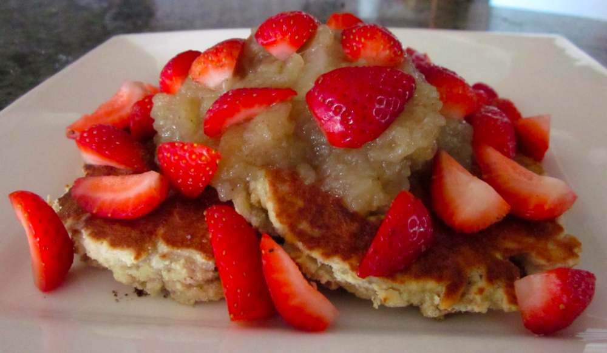
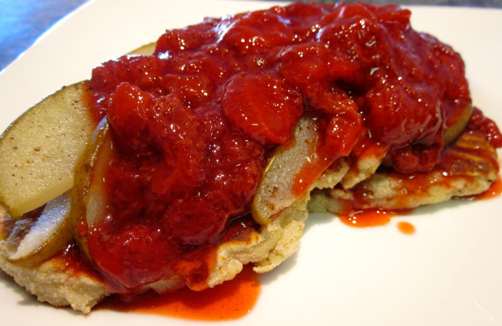

I’m not often one for luxurious brunches, partly because I usually wake up starving and want to eat breakfast straight away, and partly because of my weekend morning routine: Saturday mornings it’s off to the Farmers’ Market, and I do a Sunday morning gym class. Over Easter, however, the Farmers’ Market aren’t on and my gym’s not running its usual classes, which has made way for lazy mornings over these somewhat indulgent pancakes.

<!--more-->

These pancakes are a good way to use up bananas which have ripened beyond eating fresh. They are thicker than your usual pancakes, more fritter- or muffin-like, which works especially well with the crunchiness of the toasted almonds. The almonds could be toasted, the dry ingredients mixed and toppings prepared the night before to make these really quick in the morning.

Serves 3 generously, or perhaps 4 more respectably! (Makes about 9 8cm-diameter pancakes.)

  * 1/2 cup almond meal
  * 1/4 cup coconut flour
  * 1/2 cup plain gluten-free flour*
  * 3 teaspoons baking powder
  * 1/4 teaspoon salt
  * 1 cup ripe bananas, mashed (2 large or 3 small bananas)
  * 2 eggs, lightly whisked
  * 1/2 cup coconut milk
  * 1 tablespoon amaretti (alternatively you could try substituting 1 – 2 teaspoons almond essence)
  * 1/4 cup slivered almonds, toasted
  * 1 teaspoon butter
  * Maple syrup or honey, seasonal fruit or other toppings to serve**

*I use the brown rice gluten-free flour mix suggested in _[Gluten-Free Baking Classics][3]_, by Annalise Roberts: 6 parts brown rice flour : 2 parts potato starch : 1 part tapioca starch.

**The pancakes I served up were topped with maple syrup and apple sauce with fresh strawberries in one case, and cinnamon baked pear with strawberry sauce in the other. Recipes for the [apple sauce][4], [strawberry sauce][5] and [cinnamon baked pear][6] are below.

Optional: preheat oven to a very low heat (60-80˚C or 140-180F); you can use this to keep the first batches of pancakes warm while cooking the rest.

Combine all dry ingredients, except slivered almonds, in a large mixing bowl and mix well. In a separate, smaller bowl, combine wet ingredients except the butter.

Add the wet ingredients to the dry and stir until well combined. Stir in the toasted almonds. The batter will be much thicker and stickier than your usual pancake batter, more like a cake mix.

Heat a non-stick frying pan over a medium-low heat and melt a third of the butter in the pan. Add spoonfuls of the batter (roughly 1/3 cup in size) and use the back of a metal spoon to spread out until 1cm thick. Pancakes will be about 8-10cm in diameter. Cook until underside is golden, about 10 minutes. Flip and cook until golden on both sides. Place pancakes on an oven-proof plate or tray, lined with paper towels, and keep warm in the oven while you repeat to cook the remaining batter.

Serve immediately, topped with maple syrup or honey and fresh and/or cooked fruit.

###  Apple Sauce

Makes roughly  1 1/2 cups, which is about right for the above quantity of pancakes.

  * 3 granny-smith* apples, peeled, cored and chopped into about 1cm pieces
  * 1/2-1 teaspoon ground cinnamon, or 1/2 a cinnamon stick
  * 1/4-1/2 teaspoon ground cloves, or 9 whole cloves
  * 1 teaspoon raw sugar (white would also work)

*if you happen to have a different variety of apples on hand, go ahead and use them, but omit the sugar. You could also use a similar recipe with pears.

Place apples in a small saucepan and add barely enough boiling water to cover. If using cinnamon stick and whole cloves add these now as well. Simmer until apple is soft and mushy, about 5-10 minutes.

Drain apples, and fish out the spices (if added). Mash the apple. Add sugar and ground spices (if using) to taste and you’re done. This sauce will keep in the fridge for a few days.

###  Strawberry Sauce

Makes roughly  1 1/2 cups, which is generous for the above quantity of pancakes as this sauce is very strong.

  * 500g fresh strawberries*, stems removed, halved
  * Juice of half a lemon (about 1 – 1 1/2 tablespoons. You could also try substituting balsamic vinegar, in which case you might want to cut down the sugar)
  * 1 tablespoon caster sugar
  * 1 teaspoon vanilla essence

*This recipe will work with most fresh or frozen berries, just adjust the sugar and lemon juice to taste.

Place strawberries in a small saucepan over a medium heat, and toss with sugar and lemon juice. Cook, stirring occasionally, until strawberries are soft, about 10-15 minutes. Break the strawberries up a bit if they are large or haven’t started to disintegrate. Mix in vanilla essence.

Allow to cool slightly before serving. This sauce will keep in the fridge for a few days.

###  Cinnamon Baked Pear

Serves 3-4 as a pancake topping, again matching the above quantity of pancakes.

  * 2 pears*, cored and cut into thin wedges/slices (about 5mm at their thickest point)
  * A few pinches cinnamon
  * Olive oil

*This would also work well with apples or perhaps peaches, but for peaches I’d double the thickness of the slices.

Preheat oven to 180˚C (350 F). Brush a baking tray lightly with olive oil.

Spread pear slices in a single layer on the baking tray, and sprinkle with cinnamon. Bake until pear is tender, about 15-20 minutes. Very ripe fruit might cook more quickly, slightly under-ripe will take a bit longer.

 [3]: http://www.amazon.com/Gluten-Free-Baking-Classics-Annalise-Roberts/dp/1572840994%3FSubscriptionId%3D0ENGV10E9K9QDNSJ5C82%26tag%3Dfredel09-20%26linkCode%3Dxm2%26camp%3D2025%26creative%3D165953%26creativeASIN%3D1572840994
 [4]: #applesauce
 [5]: #strawberrysauce
 [6]: #cinnamonbakedpear