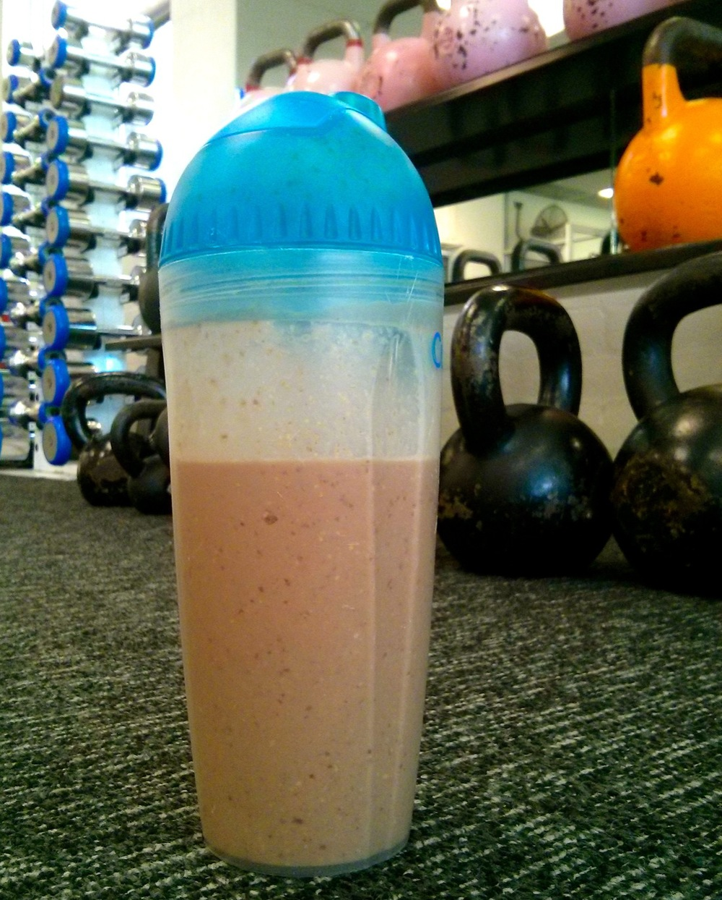

This is one of my favourite post-workout snacks. It’s something of a cross between an egg flip and a banana smoothie and has good doses of both carbohydrates and protein to assist in recovery. I like to make it in two flavours: chocolate or vanilla.

<!--more-->

I’ll make this in the morning, keep it in the fridge at work and find it’s still fine for evening consumption. 

For a nut-free version, skip the LSA. For a dairy/lactose free option, replace the milk with soy milk or other non-dairy milk and likewise skip the yoghurt or use a non-dairy alternative.

Makes 1 large serving

  * 1 banana
  * 2 eggs
  * 1/2 cup milk
  * 2 tablespoons natural or greek yoghurt
  * 1 tablespoon LSA
  * 2 teaspoons cocoa powder or 1/2 teaspoon vanilla essence (adjust to taste)

Combine all ingredients in a blender and blend until smooth. How easy is that?!
