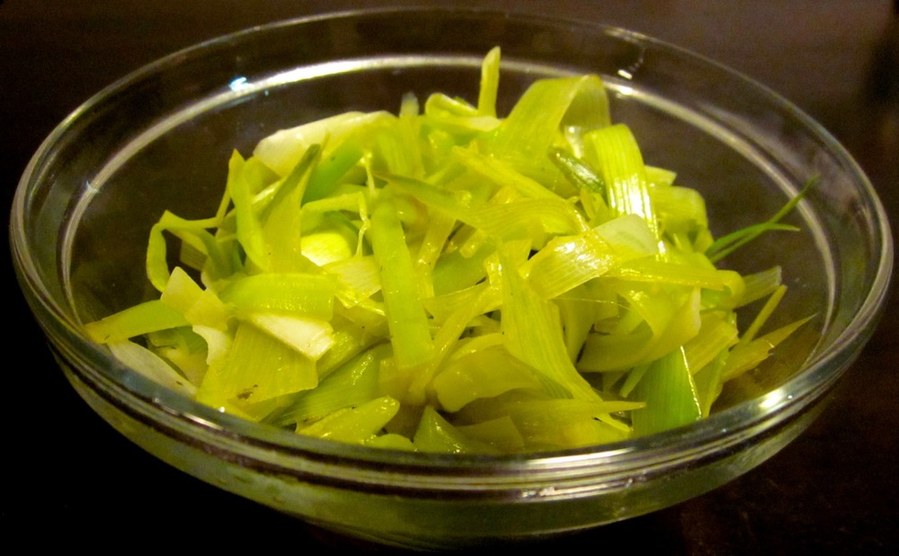

I only used to use leeks in vegetable stock or occasionally pasta sauce. That was until I noticed my partner got excited whenever I bought leeks or added them to dinner. I have since been experimenting with other ways of cooking leeks, where they can be enjoyed in their own right. Braising leeks in vegetable stock is really straight-forward and makes for a tasty and healthy side.

<!--more-->

Look for leeks with a long white section at the base for this dish; the tough dark-green leaves aren’t used here, so either discard them or set them aside to add to stock.

Serves 2 as a side

  * 2 leeks (white and light-green parts only) thoroughly washed and thinly sliced
  * 2 tablespoons olive oil
  * 1/4 cup dry white wine (optional)
  * 1/2 cup vegetable stock (or 3/4 cup if not using wine)
  * salt and pepper

Heat olive oil in a frying pan over medium heat. Add leeks and saute for a few minutes until starting to soften. If using, add wine and cook until almost evaporated, otherwise, go straight to the next step. Add vegetable stock and cook until most of the liquid has evaporated and the leeks are tender. Add a little extra stock or hot water if needed while cooking. Season with salt and pepper to taste.
