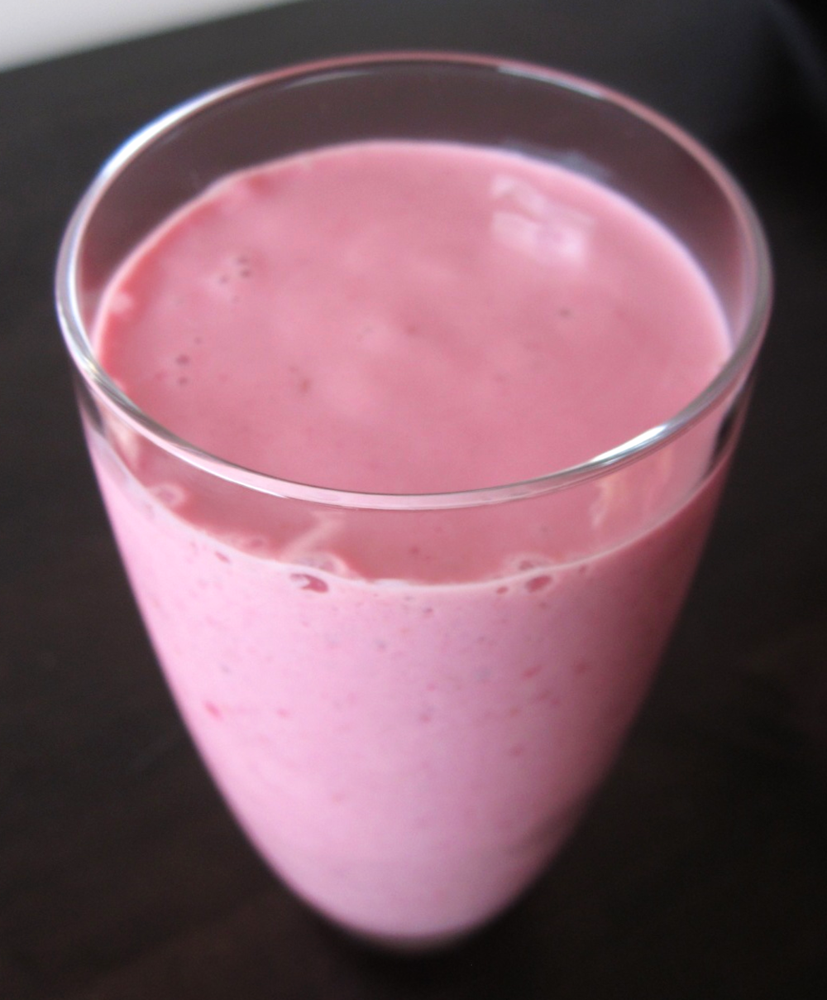

I am very much a creature of habit when it comes to breakfast. Breakfast for me takes one of two forms, almost every day of the year. These smoothies are my warm-weather breakfast. (You’ll find out what my cold-weather breakfast is when the Canberra weather decides to turn chilly for the year). Don’t let the apparent monotony fool you, breakfast is one of my favourite meals of the day as it’s so very yummy!

<!--more-->

Serves 2

  * 2 bananas, cut into thick slices (unless you’re using a mango, in which case only use 1 banana)
  * 125-150g silken tofu
  * 4 heaped tablespoons, about 1/2 cup, natural yoghurt
  * 1/2 cup apple juice

and one of:

  * 1 1/2 cups frozen rasberries, strawberries or mixed berries; or
  * 1 cup frozen blueberries (substitute dairy or soy milk for the apple juice, I find the blueberries and apple juice a bit too sweet); or
  * flesh of 1 mango (only use one banana, you may like to try orange or tropical juice instead of apple, also it wont be as chilly as using frozen berries, so add a few ice-blocks as well); or
  * try your own fruit combinations, or just leave it as a plain banana smoothie.

Combine all ingredients in a blender and blend until smooth. Pour into glasses and enjoy!
