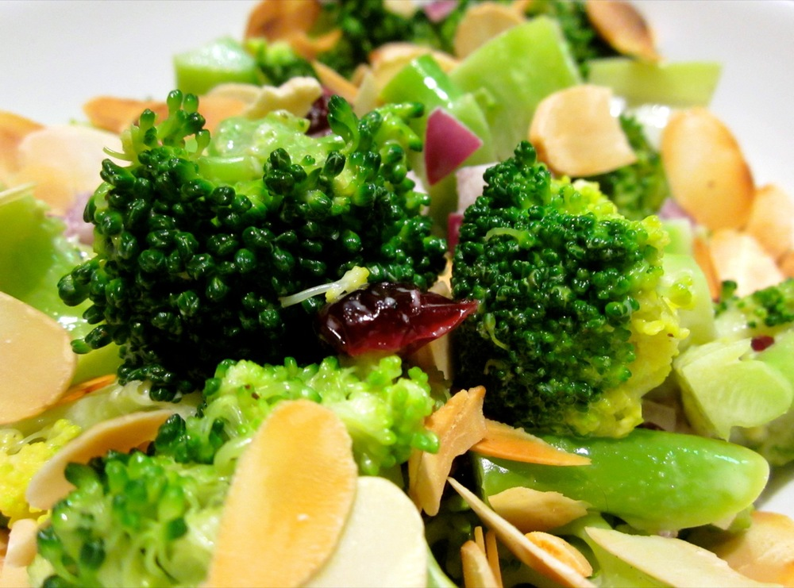

I made mayonnaise on the weekend to serve with a baked snapper, and had some left over. Pondering what to do with it, I remembered this unusual broccoli salad, which is an interesting mix of a creamy dressing, sweet cranberries and of course nice healthy broccoli. If you have someone who doesn’t like their greens, perhaps give this one a try.

<!--more-->

Despite the broccoli, this is actually quite a sweet salad, so keep this in mind when thinking about what to pair it with (perhaps a quiche or grilled fish).

For a nut-free version, just skip the almonds.

Serves 4 as a side

  * 2 heads broccoli, stems and florets, chopped into bite-size pieces
  * 1/2 cup mayonnaise*
  * 1 scant tablespoon red wine vinegar
  * 2 teaspoons honey
  * 1/4 red onion, finely chopped
  * 1/2 cup dried cranberries
  * 1/2 cup flaked or slivered almonds, toasted

*On this occasion I used homemade mayonnaise, which was delicious, but I have made this with store-bought before and that works too. This was my first time making mayonnaise so I haven’t developed my own version yet, but if you’re interested, the recipe I followed can be found [here][mayonnaise].

Steam the broccoli until just tender, you want it to retain some crispness so try and avoid over-cooking. The stems will take a little longer to cook, so I generally start steaming these first, then after a few minutes add the florets and steam for another couple of minutes. When cooked, swirl the broccoli in icy water to chill. This will both stop the cooking and chill it for the salad. Drain and pat dry.

To make the dressing, mix mayonnaise, vinegar and honey together in a small bowl.

Combine broccoli, onion and cranberries. Pour in dressing and toss to coat. Sprinkle the almonds over the top just before serving. (The cranberries and onion have a habit of accumulating in the bottom of a large salad bowl, so take note to scoop these up as you’re serving the broccoli.)

 [mayonnaise]: http://www.guardian.co.uk/lifeandstyle/wordofmouth/2010/jul/01/how-to-make-perfect-mayonnaise