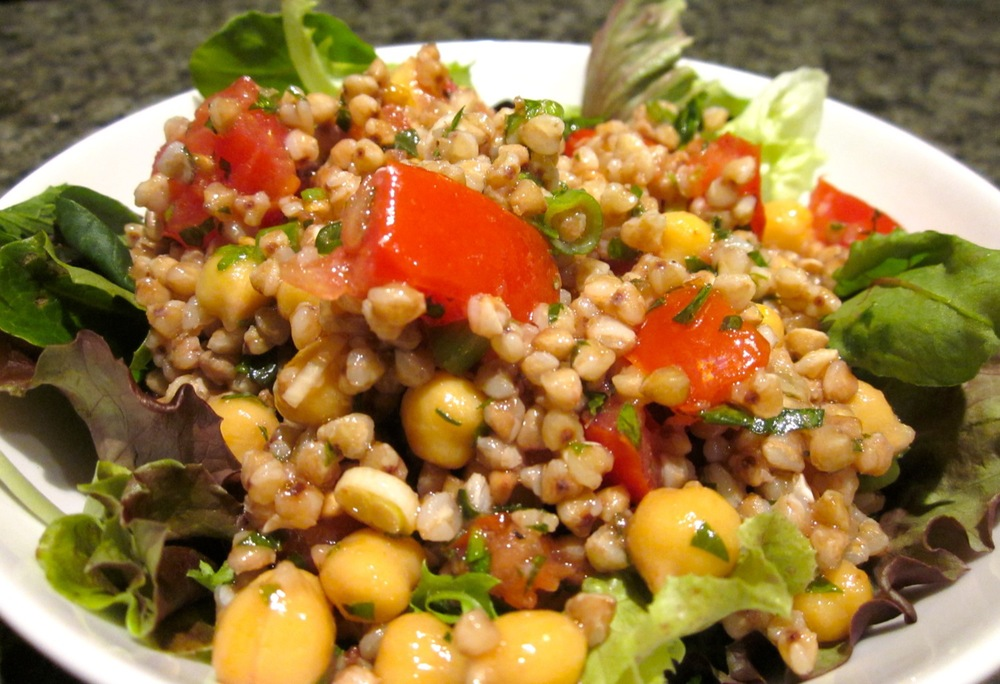

Despite my best intentions, as usual I ate too much chocolate in too short a time over Easter. As a result, part of me is craving more chocolate and other junk, a craving I’m trying very hard to ignore. At the same time, when I’ve had too much sugar part of me also craves really fresh and ultra-healthy food, so I made up a big bowl of this buckwheat and chickpea tabouli for dinner last night. This isn’t just a salad for post-Easter detoxes though, it’s tasty, nutritious and refreshing and makes a great lunch or light dinner any time.

<!--more-->

The recipe is a modification of one of Carol Fenster’s from [The Gluten-Free Vegetarian Kitchen][gluten-free-vegetarian-kitchen]. For a quicker option, or a vegan alternative, skip the egg and go straight to cooking the buckwheat in vegetable stock. Cooking the buckwheat with egg helps keep the grains separate so they don’t become mushy as cooked, so I like to do this when adding the buckwheat to salads.

Serves 5

  * 1 cup buckwheat
  * 1 egg, lightly whisked (optional)
  * 1 tablespoon canola oil (only if using the egg)
  * 1 1/2 cups vegetable stock (possibly a little more of omitting the egg)
  * 1/2 cup dried chickpeas, soaked, cooked and drained, or 1 400g tin chickpeas, rinsed and drained
  * 4 shallots/scallions, finely sliced
  * 4 tomatoes, chopped, or a punnet of cherry tomatoes, halved
  * 1/2 cup fresh parsley, finely chopped
  * 1/2 cup fresh mint, finely chopped
  * 1 1/2 tablespoons red wine vinegar
  * 1 1/2 tablespoons lemon juice (juice of about half a lemon)
  * 3 tablespoons olive oil
  * salt
  * pepper
  * 3 cups lettuce leaves, coarsely chopped, or mixed greens

To cook buckwheat using an egg: Heat the canola oil in a saucepan over a medium heat, and swirl so the oil coats the bottom of the saucepan. In a small bowl combine the buckwheat and egg, then transfer to saucepan. Cook, stirring frequently with a fork, until egg has dried and grains are separate, 5-10 minutes. Add a scant 1 1/2 cups vegetable stock, bring to the boil, and simmer until stock is absorbed and buckwheat tender, about 20 minutes. If liquid dries up before the buckwheat is cooked, add a little extra stock or hot water.

Alternatively, cook buckwheat without the egg: Add 1 1/2 cups stock and buckwheat to a saucepan over medium heat. Bring stock to the boil and simmer until stock is absorbed and buckwheat tender, about 25 minutes.  If liquid dries up before the buckwheat is cooked, add a little extra stock or hot water.

Meanwhile, combine chickpeas, shallots, tomatoes, parsley and mint and a large bowl. Toss with a few pinches each of salt and pepper.

Combine vinegar, lemon juice and olive oil in a jar and shake well to emulsify.

When buckwheat is cooked, allow to cool slightly (unless you’re in a hurry), before adding to the bowl with the chickpeas and tomatoes. Toss to combine. The tomatoes and herbs will stay fresher if the buckwheat isn’t really hot when it’s added. Salad can be prepared up to here in advance.

Just before serving, pour dressing over the tabouli and mix through. Serve spooned over lettuce.

[gluten-free-vegetarian-kitchen]: http://www.amazon.com/The-Gluten-Free-Vegetarian-Kitchen-Nutritious/dp/1557885109%3FSubscriptionId%3D0ENGV10E9K9QDNSJ5C82%26tag%3Dfredel09-20%26linkCode%3Dxm2%26camp%3D2025%26creative%3D165953%26creativeASIN%3D1557885109