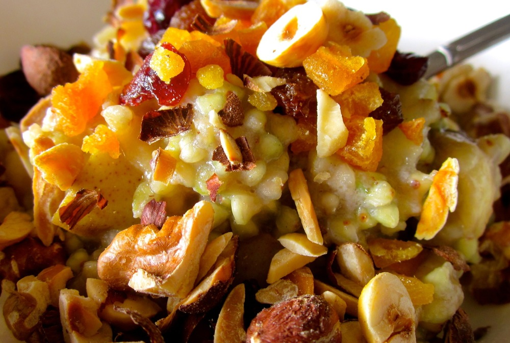

Winter has well and truly settled upon Canberra, and winter means cold mornings and warm breakfasts. The medical advice in Australia is that oats are not safe for those with coeliac disease. (I know this varies in other countries.) When I was first diagnosed my gastroenterologist explained that the reason for this is two-fold: First, oats and wheat are often grown in adjacent fields and processed on the same equipment so the risk of cross-contamination is very high. Second, oats contain a protein (called avenin) which is similar in structure to gluten and which around 1 in 5 coeliacs also react to. [Coeliac Australia][coeliac-australia] explain that there is no way to test who will react to avenin in advance, and so they actually class avenin as a type of gluten and advise that coeliacs should not eat oats. I developed this recipe the first winter after I was diagnosed with coeliac disease and it has been our regular cold-weather breakfast ever since.

<!--more-->

I make up containers of the mixed fruit and toasted nuts in advance and keep these in the pantry (store the fruit and nuts separately though to help keep the nuts nice and crunchy). The porridge can be left to simmer while you go and have a shower, but I’d only recommend this if you’ve made it a few times and know your stove so it neither boils over nor burns on the bottom in the mean time.

For a nut-free version skip the nuts. I started using soy milk as my partner is lactose-intolerant, but if lactose is okay you could substitute dairy milk.

Serves 2

  * 1/3 cup buckwheat
  * 1 cup soy milk, plus extra to serve
  * 1 cardamon pod, bruised
  * 2 cloves
  * 1-inch piece cinnamon stick (a rolling pin works well to break up a tough stick of cinnamon) 
  * 1 apple or pear, cored and cut into 1-2cm cubes
  * 1 banana, thinly sliced
  * 2 tablespoons mixed dried fruit (I use sultanas, cranberries, and chopped dried apricots) 
  * 2 tablespoons mixed nuts, toasted (I use slivered almonds, chopped hazelnuts and chopped walnuts)
  * 1 teaspoon honey, or to taste (I just dip the tip of each dessert spoon in the honey as serving and this is about right) 

Combine buckwheat, 1 cup milk and the spices in a small saucepan over a medium heat and bring to the boil. Reduce heat to low and simmer, stirring occasionally, until buckwheat is tender and milk absorbed, 20-30 minutes depending on how strong a simmer you have. If porridge dries out, add a little extra milk or the liquid from stewing the fruit (keep reading).

Meanwhile, stew the apple or pear: Place apple or pear in a small microwave-safe bowl, and pour over enough water to barely cover the fruit. Microwave for 3-5 minutes until tender then drain. (A ripe pear will cook in 3 minutes, an apple covered with cold water will need 5 minutes.)

Once the buckwheat is cooked, fish out the spices. Mix in banana and apple or pear and divide into two cereal bowls. Sprinkle each bowl with a spoonful each of dried fruit and nuts, stir through a little honey and add extra milk to taste.

[coeliac-australia]: http://www.coeliac.org.au/coeliac-disease/faq.html
