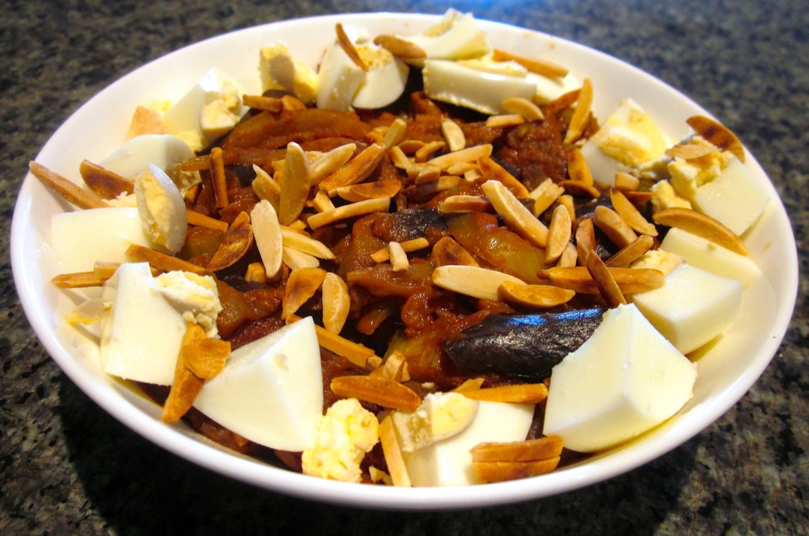

This is my take on the caponata recipe in Stephanie Alexander’s [The Cook’s Companion][cooks-companion]. The combination of  acidity from the vinegar, sweetness from the sugar and the depth of the cocoa results in a really interesting flavour, which some people like more than others. My partner loves it. I think it’s exciting that I get to use cocoa in a savoury dish!

<!--more-->

The tomato sauce can be made in advance and stored in the fridge for a few days, or in the freezer for longer.

For vegan or nut-free versions, omit the eggs or almonds respectively.

Serves 5

  * 2 large or 3 medium eggplants, chopped into 2cm cubes
  * 1 kg tomatoes
  * 2 onions, one diced and one sliced
  * olive oil
  * 4 cloves garlic, finely chopped or crushed
  * salt
  * pepper
  * 6 stalks celery, cut into 1cm pieces
  * 1/4 cup capers, drained
  * 1/3 cup white wine vinegar
  * 2 tablespoons raw sugar plus a little extra (the extra is optional)
  * 1 1/2 tablespoons cocoa powder

To serve:

  * 5 eggs, hardboiled, peeled and chopped (if feeding large appetites, add a couple more eggs)
  * 1/2 cup slivered almonds, toasted
  * 1 cup brown rice, cooked

Sprinkle the eggplant cubes with salt and set aside to drain for 30 minutes. The salt will draw out bitter liquids from the eggplant, improving the flavour. Alternatively, bring a large pot of water to the boil and cook the eggplant for 5-10 minutes. There’s a fair bit of debate around about whether this is necessary, and which method is best; I have found eggplant does benefit from some treatment, and either method works well for this recipe.

Make the tomato sauce: Peel, seed and chop tomatoes. The Former Chef blog provides a good set of instructions on [How to Peel and Seed Tomatoes][peel-tomatoes].

Heat 1 tablespoon olive oil in a frying pan over medium heat, add the **diced** onion and cook until soft, about 5-10 minutes. Add the garlic and cook for another minute. Add the tomatoes, bring to the simmer then turn the heat down to low (or you’ll end up with tomato juice splattered all over your stove top). Cook, stirring occasionally, until sauce has thickened. Taste and add a pinch of sugar if the sauce is tart. Season to taste with salt and pepper. Set sauce aside to cool. When the sauce is cool enough, use a blender to puree until smooth.

Returning to the eggplant: rinse the salted eggplant well and pat dry. Heat 2 tablespoons of olive oil in a frying pan over high heat. Add half the eggplant and fry until lightly golden brown. Set aside to drain over some paper towel, add another tablespoon or two of oil to the pan and repeat with remaining eggplant.

Bring a saucepan of water to the boil over a medium heat. Add celery and blanch for two minutes then drain.

Heat another tablespoon of olive oil in a frying pan over medium heat. Add the **sliced** onion and cook until soft. Add the celery and cook for a minute longer. Next add the capers, vinegar, sugar, cocoa and tomato sauce and cook for 5 minutes, stirring occasionally. Check the flavour and adjust vinegar, sugar and cocoa to taste. Add the eggplant and cook for a further 10 minutes.

Serve over brown rice, sprinkle with toasted almonds and surround with the hardboiled eggs.

 [cooks-companion]: http://www.amazon.com/The-Cooks-Companion-Ingredients-Australian/dp/1920989005%3FSubscriptionId%3D0ENGV10E9K9QDNSJ5C82%26tag%3Dfredel09-20%26linkCode%3Dxm2%26camp%3D2025%26creative%3D165953%26creativeASIN%3D1920989005
 [peel-tomatoes]: http://www.formerchef.com/2009/08/20/how-to-peel-and-seed-fresh-tomatoes/