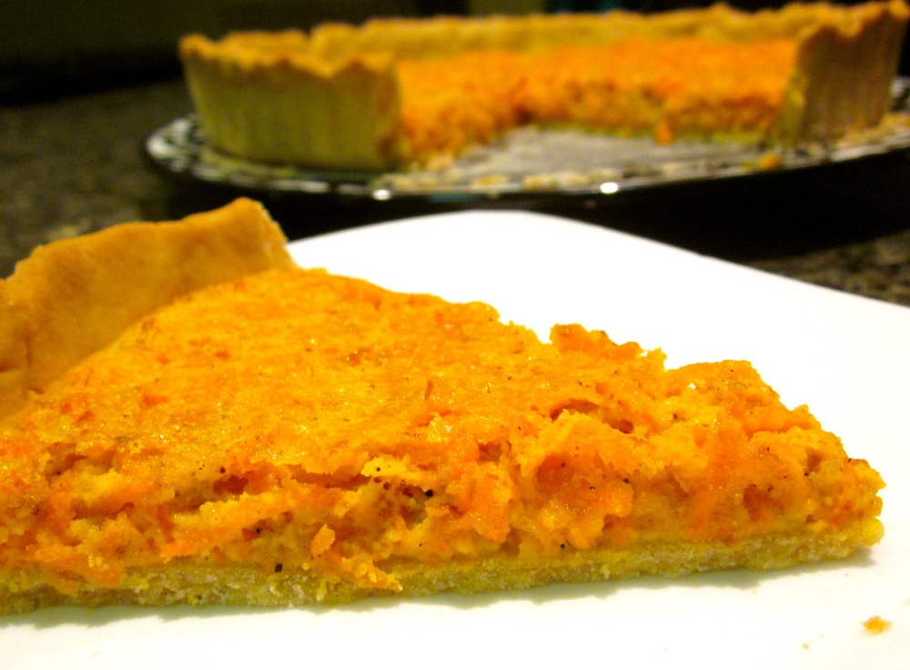
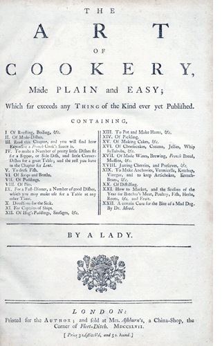

I am undecided whether this is a sweet or savoury dish. Being an optimist, I like to convince myself it’s savoury and have it for lunch paired with a leafy green salad. It’s also nice for afternoon tea or as part of a spread.

<!--more-->

While I first encountered this via Stephanie Alexander, it’s actually based on a recipe published by Hannah Glasse in The Art of Cookery Made Plain and Easy in the 18th Century! I don’t know about you, but being a lover of history I think that’s really cool. I tracked down [a copy of the original 1747 recipe on Celtnet][carrot-tart-recipe]:

> _To make a carrot pudding_
> 
>  YOU muſt take a raw carrot, ſcrape it very clean and grate it: Take half a pound of the grated carrot, and a pound of grated bread, beat up eight eggs, leave out half the whites, and mix the eggs with half a pint of cream : then ſtir in the bread and carrot, half a pound of freſh butter melted, half a pint of ſack, and three ſpoonfuls of orange-flower-water, a nutmeg grated. Sweeten to your palate. Mix all well together, and if it is not thin enough, ſtir in a little new milk or cream. Let it be of a moderate thickneſs, lay a puff-paſte all over the diſh, and pour in the ingredients. Bake it ; it will take an hour’s baking. Or you may boil it, but then you muſt melt butter and put in white wine and ſugar.

And here’s my 21st century gluten-free version:

Serves 6-8

  * [shortcrust pastry (recipe below)][short-crust-pastry]. Omit the sugar for this dish.
  * canola oil
  * rice flour
  * 1 medium carrot, finely grated (about 3/4 cup)
  * 1/2 cup almond meal
  * 1 egg plus 1 egg yolk, lightly whisked
  * 2/3 cup cream
  * 60g butter, melted and allowed to cool
  * 2 tablespoons caster sugar
  * 1/2 teaspoon ground nutmeg

Preheat oven to 180˚C (350F). Lightly grease a tart tin (I use one with a removable base) with canola oil. Sprinkle with a little rice flour to coat the base and shake out excess flour. Line tin with pastry, blind bake for 10 minutes, remove from oven and set aside.

To make the filling, combine all remaining ingredients and mix well. Pour into the pre-baked tart shell and return to oven. Bake until filling has set and crust is lightly golden, about 30 minutes. Serve warm or at room temperature.

###  Shortcrust pastry
 

Makes 1 23-25cm tart crust

  * 1 1/4 cups gluten-free flour*
  * 1/2 teaspoon xanthan gum
  * 1/4 teaspoon salt
  * 1 tablespoon caster sugar (optional, if using with a sweet filling)
  * 90g unsalted butter, chilled and chopped into 1-2cm pieces
  * 1 egg
  * 2 teaspoons lemon juice

*I use the brown rice gluten-free flour mix suggested in [Gluten-Free Baking Classics][gluten-free-baking-classics], by Annalise Roberts: 6 parts brown rice flour : 2 parts potato starch : 1 part tapioca starch.

I do all this in my food processor using the pastry attachment, which takes a matter of minutes, but it should work just as well mixing by hand.

Combine all dry ingredients and mix to combine. Add butter and process/stir until it’s well incorporated into the dry ingredients. You should have a consistency resembling that of of moist bread crumbs. Add the egg and lemon juice and process/stir until fully combined. Roll pastry into a ball and flatten slightly under your palm. Place between two sheets of baking paper and roll out until about 5mm thick and the right size for your dish/tin.

 [short-crust-pastry]: #shortcrustpastry
 [gluten-free-baking-classics]: http://www.amazon.com/Gluten-Free-Baking-Classics-Annalise-Roberts/dp/1572840994%3FSubscriptionId%3D0ENGV10E9K9QDNSJ5C82%26tag%3Dfredel09-20%26linkCode%3Dxm2%26camp%3D2025%26creative%3D165953%26creativeASIN%3D1572840994
 [carrot-tart-recipe]: http://www.celtnet.org.uk/recipes/glasse-lent-dinner-dishes-09.php#646