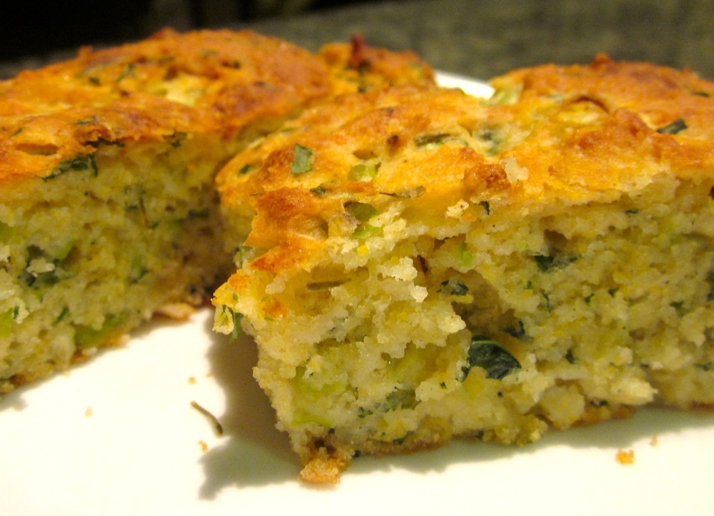

Winter is not my favourite time of year, but there are many things I do like about the cold weather: fluffy blankets, oversized jumpers, hot chocolate and warming soup being among them. The problem is what a coeliac, who’s had little success with gluten-free baking and doesn’t want to spend a small fortune on average-at-best gluten-free bread every week, have to accompany her soup? That’s where this cornbread comes in.

<!--more-->

I have lost track of the number of times I’ve read an introduction to a recipe for gluten-free baked goods along the lines of “while other gluten-free recipes may turn out too dense, dry and crumbly or tasting of cardboard, this one actually works!” only to discover that no, that recipe did not work and was in fact so bad the result ended up in the bin. Again. Hence my delight (bordering on astonishment) when this one did actually work! And it’s really good! So good that my non-coeliac partner will choose this over his (glutenated) toast, when I’m willing to share.

The recipe is based on one out of The Australian Coeliac, the magazine produced by [Coeliac Australia][coeliac-australia], which I’ve modified to suit my tastes, namely by using more fresh herbs, less sugar.

Serves 6-8 as a side

  * scant cup gluten-free flour*
  * 1/3 cup polenta
  * 1 teaspoon xanthum gum
  * 1 tablespoon caster sugar
  * 1 tablespoon gluten-free baking powder
  * 1/2 teaspoon salt
  * a few pinches pepper
  * 1 cup milk
  * 1 egg, lightly beaten
  * 2 tablespoons canola oil
  * 1/2 cup freshly grated parmesan cheese
  * 2/3 cup freshly grated cheddar cheese
  * 6 shallots, finely sliced
  * 1/4 cup fresh herbs, finely chopped (I usually use parsley with one or two others such as basil or thyme, depending on what I have on hand and what soup I’m making)

 

*I use the brown rice gluten-free flour mix suggested in [Gluten-Free Baking Classics][gluten-free-baking-classics], by Annalise Roberts: 6 parts brown rice flour : 2 parts potato starch : 1 part tapioca starch.

 

Preheat oven to 220˚C (425 F). Grease a 20cm square baking tin. 

Combine dry ingredients (flour, polenta, xanthum gum, sugar, baking powder, salt and pepper) in a large mixing bowl and mix well.

In a separate bowl, whisk together the wet ingredients (milk, egg and canola oil).

Add wet ingredients to the dry and whisk until a smooth batter is formed. Stir in the cheeses, shallots and herbs until just combined.

Pour into baking tin and bake for about 25 minutes, until top is golden and a skewer comes out clean. Check the cornbread after around 15-20 minutes – if the top is golden and you want to prevent it darkening further while the cornbread cooks through, cover the pan with foil, pricked in a few places to let out excess steam. 

Allow to cool in the pan, and serve warm or at room temperature.

[gluten-free-baking-classics]: http://www.amazon.com/Gluten-Free-Baking-Classics-Annalise-Roberts/dp/1572840994%3FSubscriptionId%3D0ENGV10E9K9QDNSJ5C82%26tag%3Dfredel09-20%26linkCode%3Dxm2%26camp%3D2025%26creative%3D165953%26creativeASIN%3D1572840994
[coeliac-australia]: http://www.coeliac.org.au/index.html