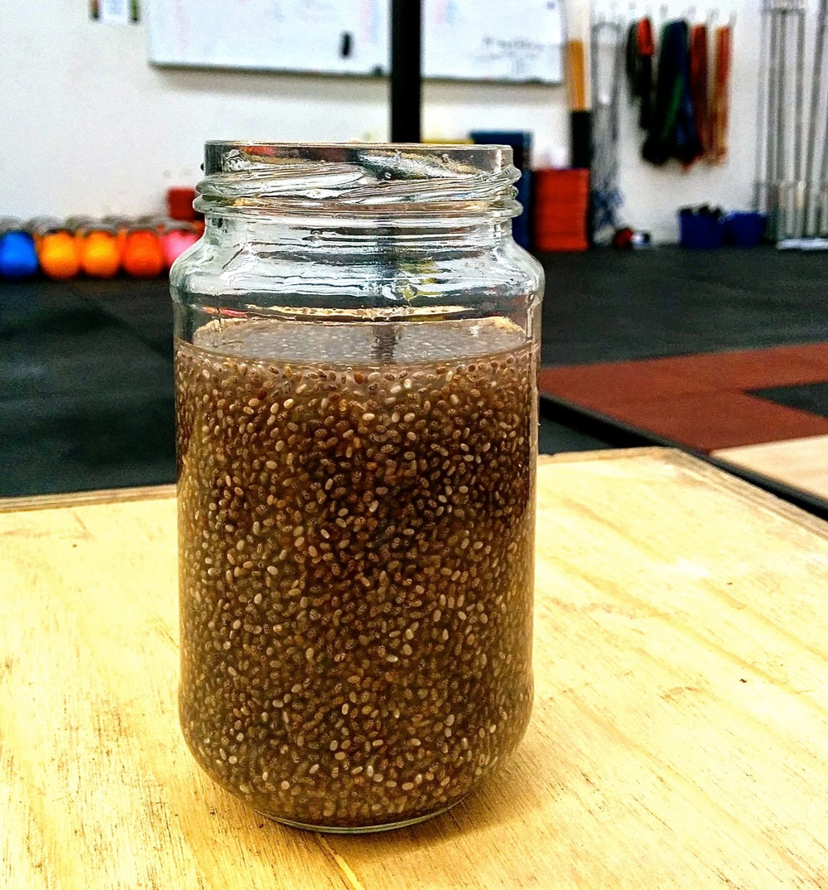

**DOES NOT CONTAIN FROG**

This snack idea is so simple I almost didn’t post it; doing so feels a bit like writing a recipe for a cup of tea. However, I’ve had at least five people ask me about this concoction in the space of a week so here it is.

<!--more-->

I particularly like chia prepared this way because it’s an energy source that’s light enough that I can drink it then proceed to exercise 15 minutes later without feeling remotely ill – even if that exercise is teaching Body Attack with it’s tuck-jump-burpees. There are not many foods for which I can say the same.

Now for the credits: idea courtesy of my sister, and the name… inspired by my mother who came close to convincing her squad of swimmers, using post-exercise nutritional arguments, that she was in fact drinking frogs eggs!

Serves 1

  * 2 tablespoons chia seeds (any colour)
  * juice of half a lemon or lime (if you like stronger citrus flavours, add juice from the whole fruit)
  * 300mL water

Combine all ingredients in a jar. Secure lid and shake well. Shake a couple of times over the next 5-10 minutes so the chia doesn’t clump together too densely. Refrigerate or allow to sit for at least 30 minutes and you’re done.
