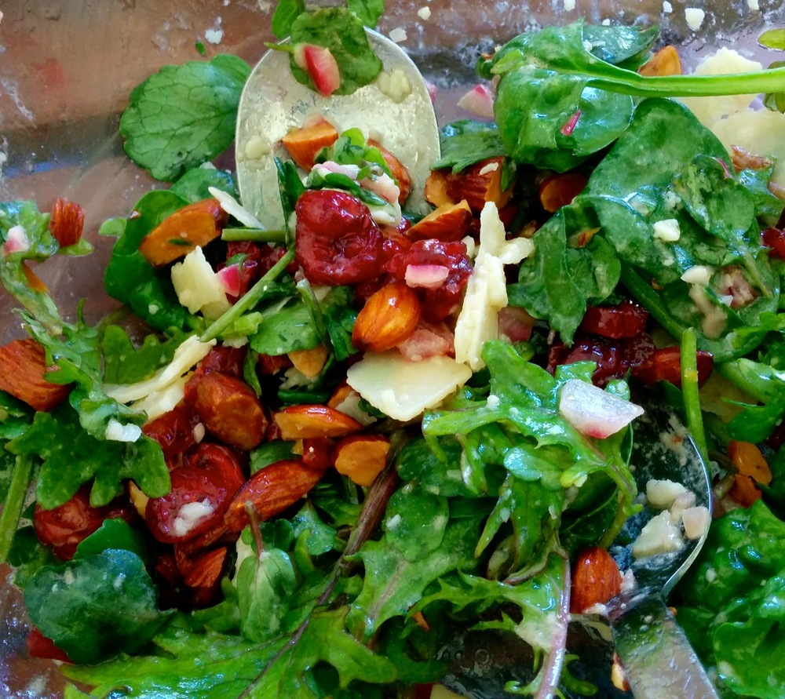

<figure> 

<blockquote>“There might not be enough food… the boys are coming and they eat A LOT.”</blockquote>

<figcaption class="source">&mdash; Lil’ sis reviewing my plans for Christmas lunch.</figcaption>

</figure>

Despite being fairly confident that there would be plenty of food I agreed to add an extra dish, opting for a leafy salad to complement the already substantial meal. As it turns out, we were still polishing off the left overs three days later! (Admittedly left-overs _are_ almost compulsory following Christmas lunch.) In this case it definitely worked out for the best because this creation is really very good (am I allowed to say that about my own recipe?)
 
<!--more-->

Back home and through the process of testing the recipe this salad has rapidly become a favourite. Only thing is, there are two versions and I can’t decide which I like best, so I’ve included both options and you can choose for yourself. 
 
The question before you is this: pomegranate or cranberries? The pomegranate seeds are refreshing and add a nice crunch. The cranberries are sweeter and slightly chewy. I like both versions. I’d suggest the pomegranate as a nice refreshing choice on a warm day, and the cranberries when you’re looking to bring a little more sweetness to the meal. Dried cranberries are also typically easier to come by than fresh pomegranates.
 
I haven’t included rocket in my leafy greens. Personally I don’t like rocket – I find it too hot – while the watercress here is just a little peppery. If you are a fan of rocket I suspect if would work well in this salad, and I always encourage experimentation when cooking.
 
For a nut free version, skip the almonds. It won’t be as crunchy but the combination of flavours should still survive. For a vegan or dairy/lactose-free alternative, omit the parmesan.

Serves 4 as a side

  * 2 cups baby kale
  * 2 cups baby spinach
  * 1 cup watercress leaves, removed from stems
  * ½ cup almonds
  * 1 pomegranate or ½ cup dried cranberries
  * ½ cup shaved parmesan
  * ½ red onion, finely sliced or diced
  * [⅓ cup mustard Vinaigrette (recipe below)][vinaigrette]

If using a pomegranate, start by seeding the fruit (otherwise, skip straight to the next paragraph). Tori Avey provides some great instructions explaining [How to Seed a Pomegranate][seed-pomegranate]. (Tori’s post also includes instructions for juicing a pomegranate – don’t go that far here, for this salad you want to keep the seeds whole.)

Place kale, spinach and watercress in a large salad bowl and toss to mix. Pour mustard vinaigrette over the top and toss again so the greens are well coated with the dressing. Add the almonds, pomegranate or cranberries, parmesan and onion. Toss to combine all ingredients and serve straight away.

###  Mustard Vinaigrette

Makes a little over ⅓ cup

  * ½ lemon, juiced (around 1½ tablespoons lemon juice)
  * 1 teaspoon dijon mustard
  * 2 teaspoons white wine vinegar
  * ¼ cup olive oil
  * pinch each of salt and pepper

Combine all ingredients in a jar, (ensure the lid is properly secured,) and shake well to combine.

[vinaigrette]: #mustardvinaigrette
[seed-pomegranate]: http://toriavey.com/toris-kitchen/2011/09/how-to-seed-a-pomegranate/#recipe
