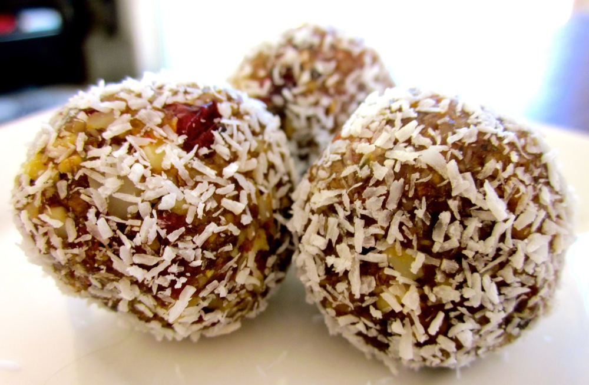

Okay, so to say this blog’s been neglected lately is something of an understatement. Sometimes life just gets in the way and there are only so many things you can keep up with at once. Well, life has settled down somewhat lately, and I’ve been getting a number of requests to start posting again, so here goes…

I’ve also been getting several enquiries around the gym about some of the concoctions I’m seen snacking on so I’ll start by sharing some of those. I eat these fruit and nut balls as a high energy-density ‘fast’ food to keep me going during long training sessions. If I’m doing two classes back-to-back I generally need to eat in between or my blood sugar can drop too low, but I don’t have much time and need something light enough that I can keep working on straight away.

<!--more-->

The ingredients are quite flexible, as long as the ratios of fruit and nuts are kept similar. I use dried dates (because they’re both very tasty and very cheap) and prunes (because they’re sticky and help hold everything together) as the base. Go ahead and experiment with whatever fruits and nuts you prefer, but I’d recommend keeping the prunes in as they’re a good culinary ‘glue’. Also don’t go overboard with the seeds, I find they don’t crush up and hold together as well as the nuts. The ingredients below are suggestions, I’ll typically choose just a few based on what’s in my pantry.

 I make up a big batch of balls and keep them in the fridge, taking about 3 balls as a ‘serving’. I can attest to them lasting at least 3-4 weeks in the fridge, mine have never lasted longer as they’re all gone by then!

For a seasonal touch: these would also be a nice treat as part of a Christmas spread.

Makes approximately 3 dozen balls

  * 1 cup dried pitted dates
  * 1 cup pitted prunes
  * 1 cup mixed dried fruit (I like sultanas, cranberries, apricots, goji berries but feel free to try anything else)
  * 2 cups mixed nuts and seeds (I like walnuts, cashews, blanched almonds, macadamias, hazelnuts, pepitas… the list goes on… but once again try whatever you like)
  * 2/3 cup desiccated coconut

Combine all ingredients except coconut in a food processor and process until fruit and nuts are well chopped and mixture holds together well. If, like me, you’ve just dumped in all the fruit then all the nuts, or vice versa, you may need to stop the processor and stir the mixture up a bit to get it well combined then process a little longer. Or you could do the sensible thing and toss the fruit and nuts together first then process.

Put the coconut in a cereal bowl. Scoop out about a tablespoon of the fruit and nut mixture (enough to make a roughly 1 inch diameter ball). Roll into a ball between your hands then roll in the coconut to coat. Set aside and repeat until all the mixture has been used up. Try not to eat all at once and enjoy!
