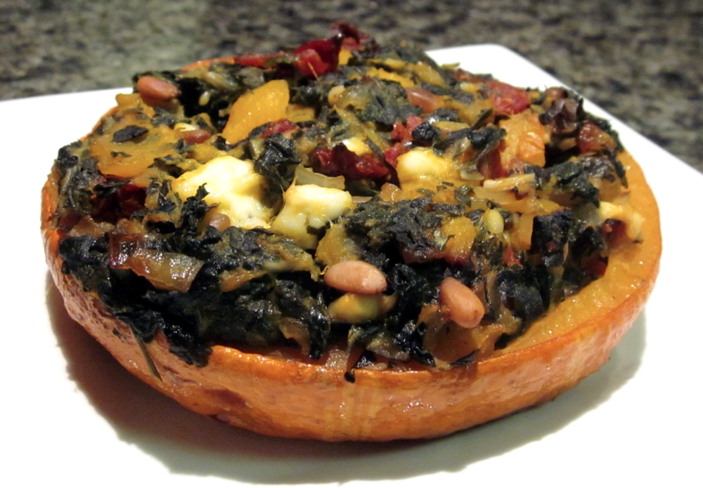

I can never resist buying the golden nugget pumpkins at the Farmers’ Market. Not only  is pumpkin wonderful to eat but this particular variety also look adorable, and when cut in half and stuffed make for a gorgeously presented meal.

<!--more-->

For vegan, dairy/lactose-free or nut-free versions, omit the fetta or pine nuts respectively.

Serves 4

  * 2 golden nugget pumpkins
  * olive oil
  * 1 bunch silverbeet
  * 1 onion, diced
  * 2 cloves garlic, finely chopped
  * 8 sundried tomato halves, drained and chopped
  * 100g fetta cheese, crumbled
  * 1/2 cup fresh herbs, finely chopped (I like using a mix of parsley, mint, basil and chives. You could also substitute a few teaspoons of dry herbs if you don’t have any fresh.)
  * 2 tablespoons pine nuts, toasted (be careful toasting pine nuts, they burn very easily.)

Preheat oven to 180˚C (360 F). Cut the pumpkins in half across the middle (i.e. into ‘top’ and ‘bottom’ halves), and scoop out the seeds. Brush cut sides with olive oil, season with salt and pepper and place face-down on a baking tray. Bake for about 45 minutes, or until tender.

Meanwhile, prepare the silverbeet stuffing: Rinse silverbeet, remove stems and coarsely chop the leaves. Heat 1 teaspoon olive oil in a frying pan over medium heat. Add onion and cook until onion is soft, about 5-10 minutes. Add the garlic and cook for another minute. Add silverbeet and continue to cook, stirring occasionally, until just wilted.

Transfer silverbeet mixture to a bowl and stir in the sundried tomatoes, fetta, herbs and pine nuts.

Once the pumpkin is cooked, scoop out part of the flesh, leaving a thick enough wall that the pumpkin halves retain their shape and can be filled. Add the scooped out pumpkin to the silverbeet stuffing and combine.

Place pumkin halves in a lightly oiled casserole dish, or on a baking tray. Fill with the silverbeet stuffing and return to the oven for 15-20 minutes, or until heated through.

