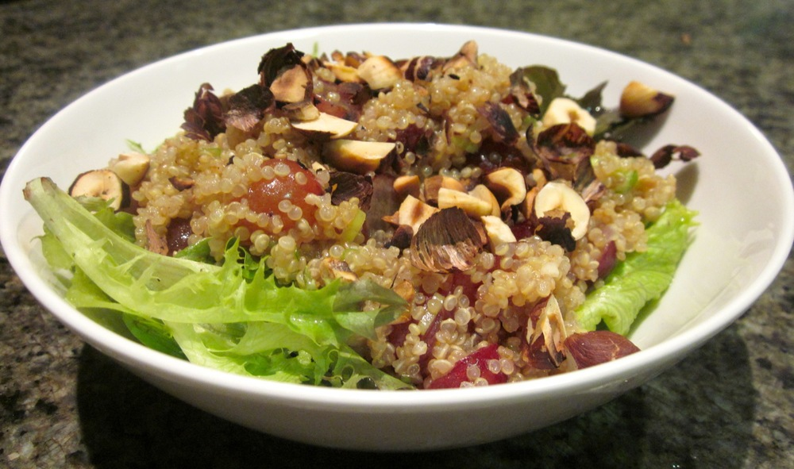

Quinoa was one of my best discoveries following my coeliac diagnosis. If I could start eating gluten tomorrow, quinoa would remain one of my staples. I really like the texture, plus quinoa is a great source of nutrients, especially protein. Quinoa is unusual for being a vegetarian complete protein, in fact it’s so nutritious the Incas revered quinoa as sacred and used it to sustain their armies.

<!--more-->

This quinoa salad is modified from a recipe in [1000 Gluten Free Recipes][gluten-free-recipes] by Carol Fenster. It is slightly sweet and makes a lovely side or light meal. 

For a nut-free version, omit the hazelnuts.

Serves 4

  * 1 cup quinoa
  * 2 cups vegetable stock
  * ½ cup hazelnuts, coarsely chopped and toasted
  * 2 or 3 shallots/scallions, finely sliced
  * 1 cup red seedless grapes, halved
  * 2 cups coarsely chopped lettuce or mixed greens
  * [Fruity balsamic dressing (recipe below)](#fruitybalsamic)

Cook the quinoa: bring 1½ cups of stock to the boil in a saucepan over medium-high heat. Reduce the heat to medium-low and add the quinoa. Cook until quinoa is tender but not mushy, about 15-20 minutes, adding extra stock as needed. I find it generally takes a bit under 2 cups, about 1¾ cups of liquid to cook 1 cup of quinoa. You can tell the quinoa is cooked because the little rings around the outside of the seed will start to separate from the central part. Allow quinoa to cool to room temperature, or chill in the fridge during warmer weather.

While the quinoa is cooking and cooling make the dressing and prepare the other ingredients.

Mix the quinoa with the grapes and shallots. Salad can be prepared up to here in advance and stored in the fridge.

Toss the salad with the dressing. Serve quinoa spooned over the lettuce or greens, and sprinkle hazelnuts over the top.

###  Fruity balsamic dressing

Makes about ⅔ cup

  * ¼ cup orange juice (juice of about ½ an orange)
  * 2 tablespoons strawberry jam
  * 2 tablespoons balsamic vinegar
  * 1½ tablespoons canola oil
  * 1 garlic clove, finely chopped or minced
  * 2 sprigs thyme
  * A few pinches salt

Strip the thyme leaves from the stems and discard the stems. Combine all ingredients in a jar and shake to combine. If the jam is not dissolving, try microwaving the dressing (for maybe 15-30 seconds, depending on the power of your microwave) to soften the jam. Alternatively you could zap the jam for 10 seconds before adding it to the other ingredients. Final suggestion is to use a small electric blender instead of a jar for mixing, if you have something suitable.
 

 [gluten-free-recipes]: http://www.amazon.com/1000-Gluten-Free-Recipes/dp/B00464EAVG%3FSubscriptionId%3D0ENGV10E9K9QDNSJ5C82%26tag%3Dfredel09-20%26linkCode%3Dxm2%26camp%3D2025%26creative%3D165953%26creativeASIN%3DB00464EAVG