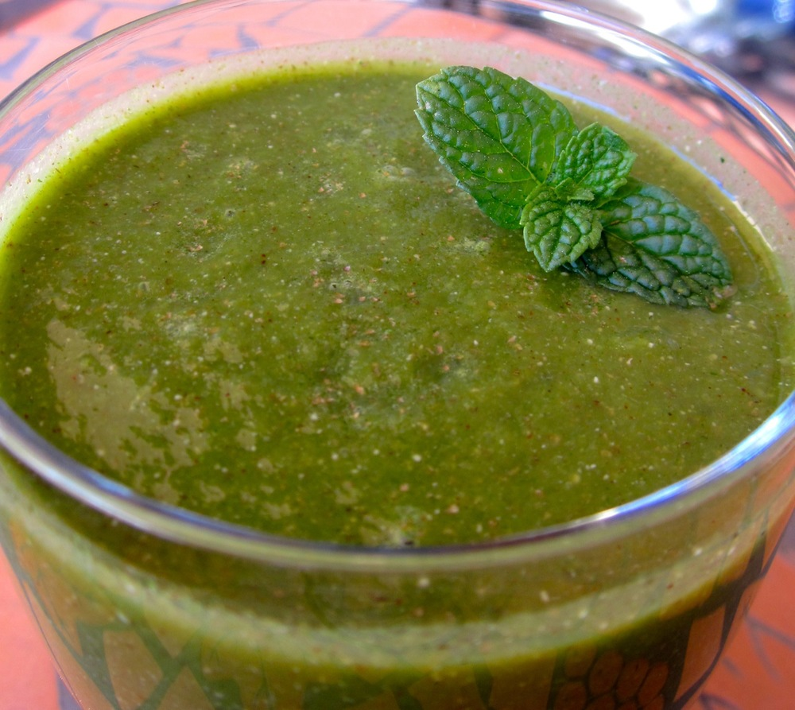

This smoothie really does taste much better than anything its colour ought. It’s sweet, refreshing and nutritious all at the same time. I mean really, how can something so green not be good for you?!

<!--more-->

This recipe is based on one by [one by The Shiksa][green-smoothie]. The slight graininess in the texture comes from the chia seeds; if you don’t like it cut down the chia or try soaking the seeds it in advance. If you want to soak the chia seeds, just pour a little hot water over them and stir, allow to sit for an hour or two then add the seeds and their soaking water to the smoothie.

When making this, don’t throw everything in the blender at once or you’ll end up with chunks in your smoothie. Add the fruit and kale one handful at a time and you’ll get much better results.

Makes around 1.4L which is enough for about 4 normal glasses, but I split this into two 750mL bottles and take one into work each day.

  * 1 1/2 cups cold water
  * 1 pear, cored and chopped
  * 1 granny smith apple, cored and chopped
  * 1/2 cup green grapes
  * 2 tablespoons chia seeds
  * 1 cup, loosely packed, fresh mint leaves
  * 1/2 bunch (2-3 cups) kale, coarsely chopped
  * juice of 1 lime, about 2 tablespoons
  * 1 teaspoon ground cinnamon
  * 8 or more ice cubes, depending on how cold you’d like it

Place the water in a blender and add one handful of the pear/apple. Blend until smooth. Continue adding the pear and apple, a handful at a time, blending between each handful. Add the grapes and blend until smooth. Add the chia seeds, blend until smooth. Add the mint, blend again. Add the kale, again only a handful at a time, blending between each batch. Add the lime juice and cinnamon and blend until well mixed. Add the ice-cubes, blend until crushed and enjoy!

 [green-smoothie]: http://theshiksa.com/2013/04/03/green-smoothie/