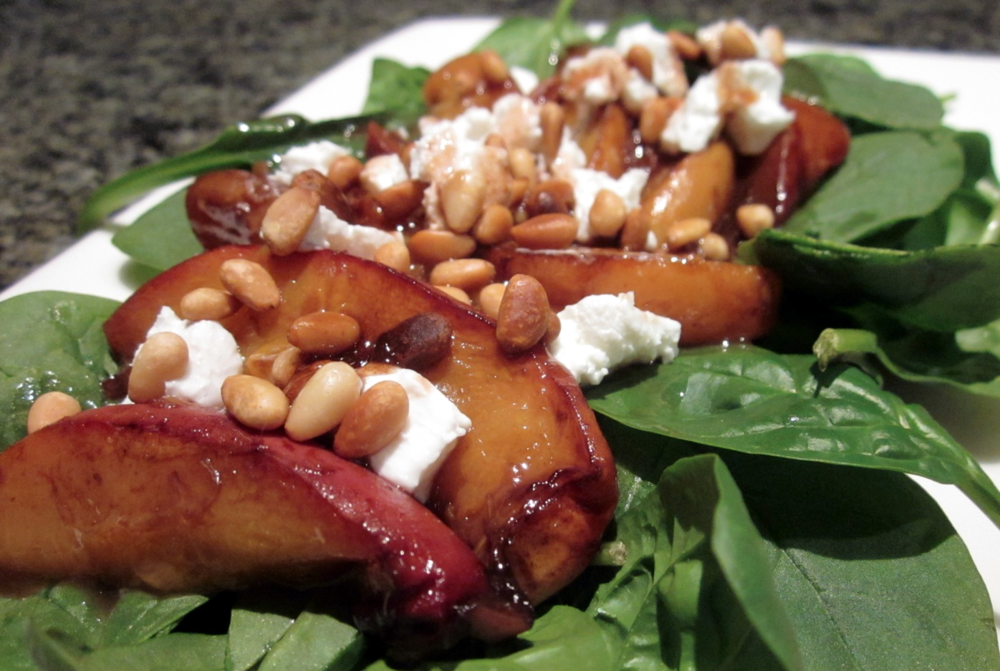

This recipe came into being after I bought a batch of peaches which turned out to be horribly floury and inedible. Fortunately, even the most unappetising of peaches become a delicacy when cooked.

<!--more-->

For vegan, dairy/lactose-free or nut-free versions, omit the chèvre or pine nuts respectively.

Serves 2

  * 2 peaches
  * 1 tablespoon brandy
  * 1 tablespoon olive oil
  * t tablespoon balsamic vinegar
  * black pepper
  * 50 g chèvre (goat cheese)
  * 2 tablespoons pine nuts, toasted*
  * 2 cups baby spinach

*It pays to be watchful when toasting pine nuts, once heated they can go from raw to black in the space of a minute or two.

Preheat oven to 180˚C (360 F). Halve the peaches, remove the stone, and slice into wedges. Toss with brandy, olive oil and balsamic vinegar. Spread on a baking tray and cook for about 20 minutes, or until tender.

Spread baby spinach on serving plates, and top with the peach slices. Crumble the chèvre over the top, and sprinkle with pine nuts. There will probably be some syrup left in the bottom of the baking tray; drizzle this across the salad and serve.

