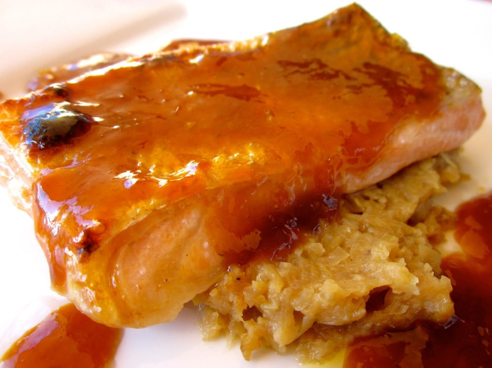

This orange-soy sauce, out of [Fish Without A Doubt][fish-without-a-doubt], is one of my favorites. The combination of the sweet, salty and buttery is just devine. The fennel puree is more mellow and adds a nice contrast. Try pairing this with the [marinated mushrooms, fennel and grilled potato salad][mushroom-fennel-potato-salad].

<!--more-->

The orange-soy sauce is very rich; it finishes off a fillet of salmon nicely, but if serving with a white fish I’d suggest using sparingly.

I like peanut oil for grilling as it has a high smoke point so stands up to the high temperatures of grilling better than, say, olive oil. For a nut-free version, substitute another oil with a relatively high smoke point, such as canola oil.

Serves 2

  * 300-350g salmon fillets
  * Peanut oil
  * salt
  * pepper
  * [Fennel puree (recipe below)](#fennelpuree)
  * [Orange-soy sauce (recipe below)](#orangesoysauce)

Rinse salmon fillets and pat dry. The salmon I buy at the markets is often thick at one end and much thinner at the other. If this is the case for your fish, cut into ‘thick’ and ‘thin’ pieces. I’m not sure how conventional this is, but I find separating the fillets like this allows you to cook both parts nicely, without leaving the thick section underdone or the thin part dry.

Brush salmon with a little peanut oil to coat, and place, skin side up, on a tray. Sprinkle lightly with salt and pepper. Cook fillets under grill or broiler for about 8 minutes, for inch thick fillets. If you have thinner parts as well, add these after about 3 minutes and they should be done at about the same time as the rest. You can check the salmon is cooked by cutting into one of the fillets, but I usually aim for salmon to be very slightly undercooked when I take it out. The salmon will continue to cook from the residual heat as you plate it up, and salmon dries out very quickly with only a couple of extra minutes of cooking.

Dollop fennel puree onto plates and place salmon next to or atop the puree. Spoon orange-soy sauce over and around the salmon and serve immediately.

###  Fennel puree

Serves 2-3 as a side. Note you’ll also need a little cheese cloth and twine (or similar). If you don’t have these, try using a tea ball instead.

  * 1 large bulb fennel, trimmed and cut into 1cm thick slices
  * 2 tablespoons unsalted butter
  * 1 teaspoon fennel seeds, toasted
  * 1/2 teaspoon dried tarragon
  * 1/3 cup dry white wine (optional)

Wrap the fennel seeds and tarragon in cheese cloth and tie closed to form a little bundle.

Melt butter in a frying pan over medium heat and add the fennel slices. Cook for about 5 minutes until fennel starts to soften. Add the bundle containing the fennel seeds and tarragon. If using wine, add this now and cook until the pan is almost dry.

Add enough hot water to barely cover the fennel. Cover the frying pan with a lid if it has one, otherwise cover firmly with a sheet of alfoil. If using a lid, leave slightly ajar to allow steam to escape (unless it has a small hole in it for this purpose). If using foil, prick a couple of small holes in it with a fork or skewer. Cook until fennel is very soft and pan is almost dry, 15-20 minutes. Add extra hot water while cooking if needed.

Remove bundle and puree fennel in a food processor. Serve warm.

###  Orange-soy sauce

For the quantitiy of sauce below I do it all in one saucepan. If making a larger batch I’d suggest starting with a larger pan to speed up the reduction of the juice, then transferring the reduction to a small saucepan to finish off the cooking.

Makes about 1/3 cup, enough to accompany 2-3 serves of salmon or more of a more delicate fish.

  * 1 cup fresh orange juice (juice of 2-3 oranges)
  * 1/2 teaspoon soy sauce (if you can’t find gluten-free soy sauce, use tamari instead)
  * 30g (2 tablespoons) unsalted butter, chopped into pieces

Heat orange juice in a small saucepan and bring to the boil (keep an eye on it as the juice will boil over if it gets too hot). Reduce heat so you have an active simmer and cook until juice is reduced to 2-3 tablespoons, by which point it should be starting to thicken. Stir in the soy sauce. Add the butter one or two pieces at a time, whisking to incorporate before adding more, until all the butter is added and sauce is well mixed. If not serving immediately, then just before serving reheat and whisk to recombine if the sauce has started to separate.

 [fish-without-a-doubt]: http://www.amazon.com/Fish-Without-Doubt-Essential-Companion/dp/061853119X%3FSubscriptionId%3D0ENGV10E9K9QDNSJ5C82%26tag%3Dfredel09-20%26linkCode%3Dxm2%26camp%3D2025%26creative%3D165953%26creativeASIN%3D061853119X
 [mushroom-fennel-potato-salad]: /2013/04/25/2013-4-22-marinated-mushroom-fennel-and-grilled-potato-salad/