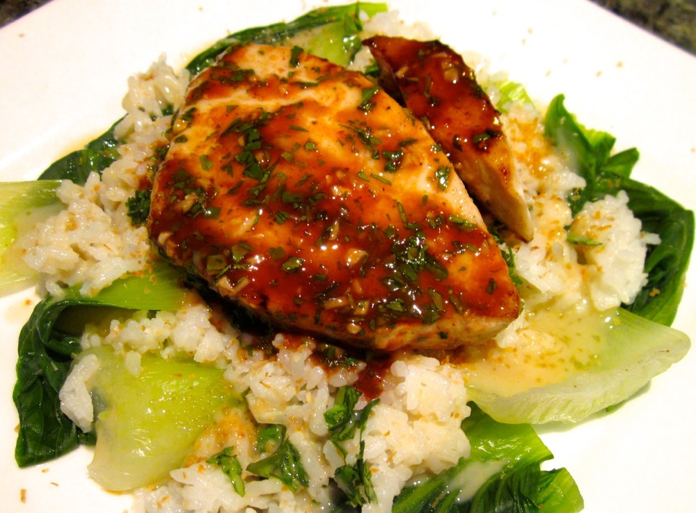

The weekend is just around the corner, and on weekends I usually cook fish. I like to cook fish the same day I buy it, and I can get beautiful fresh fish from the markets on Saturdays. This swordfish, paired with coconut rice and steamed bok choy, is last weekend’s creation. Swordfish has a firmer, more dense consistency than most other fish, which isn’t overwhelmed by the strong flavours of the glaze and sauce here. I’ve also made this with salmon which was very successful too (cooking time just needs to be increased a tad).

<!--more-->

The glaze and sauce are based on recipes in [Fish Without A Doubt][fish-without-a-doubt] by Rick Moonen and Roy Finamore. I prefer to keep my cooking quite mild, but if you’re okay with spicy food you may like to increase the quantity of curry paste used. I really like coconut so use lots of coconut milk with the rice, but it does make it a little ‘gluggier’. If you’d rather a consistency more like steamed rice just replace a portion of the coconut milk with water.

For a nut-free version, simply substitute the peanut oil for vegetable or canola (and check the ingredients of the green curry paste you buy).

Serves 4

  * 600-700g swordfish steaks
  * Peanut oil (or substitute vegetable or canola oil)
  * [Hoisin glaze (recipe below)](#hoisinglaze)
  * [Green curry coconut sauce (recipe below)](#greencurrycoconutsauce)
  * [Coconut rice (recipe below)](#coconutrice)
  * 2 bunches bok choy, leaves separated and washed
  * 1 tablespoon desiccated or shredded coconut, lightly toasted
  * 1 tablespoon fresh coriander, finely chopped

Start by preparing the rice, glaze and sauce as below; once they’re done the bok choy and fish wont take long.

Steam the bok choy: This is perhaps a bit unconventional, but I cut the thick stems from the leaves and put the stems in the steamer first. After 2 minutes, I add the leaves and steam for another minute.

Brush swordfish with oil and season with salt and pepper. Heat a grill pan (if you don’t have a grill pan, a frying pan will also work) over medium-high heat. Grill swordfish for 5 minutes. Brush the top side with glaze then flip and grill for about 1 minute, until barely cooked through. Brush the (now) top side with glaze.

To serve: Divide bok choy among four plates, spoon coconut rice over the top and sprinkle with coconut and coriander. Pour green curry coconut sauce over the rice and around the plate. Finally, top with the swordfish, and if you haven’t used all the glaze add this to the fish now.

###  Hoisin Glaze

  * 2 tablespoons hoisin sauce
  * 1 tablespoon lime juice (juice of about half a lime)
  * 1 teaspoon honey
  * 1 clove garlic, very finely chopped or minced
  * 1 tablespoon fresh coriander, finely chopped
  * pinch salt
  * pinch pepper

Simply combine all ingredients in a small bowl and mix well. This will keep for a couple of days in the fridge.

###  Green Curry Coconut Sauce

  * 2 tablespoons peanut oil (or substitute vegetable or canola oil)
  * 1 stick lemongrass, finely chopped
  * 4 cloves garlic, finely chopped or minced
  * 2 kaffir lime leaves
  * 2 teaspoons green curry paste
  * 1/4 cup dry white wine (optional)
  * 400mL coconut milk
  * salt
  * 1 teaspoon sugar
  * 2 teaspoons lime juice

Heat oil in a small saucepan over medium-high heat. Add the lemongrass and garlic and cook, stirring, until fragrant, a few minutes. Add the kaffir lime leaves and curry paste and cook for another minute. Add the wine (if using, otherwise go straight to adding the coconut milk), stir to dissolve curry paste, and bring to a boil. Reduce heat slightly and simmer until the wine has reduced by about half and you have a thicker consistency, about 10 minutes.

Stir in the coconut milk and season with a pinch of salt. Bring to the boil, but keep an eye on it as it can boil over quickly. Reduce heat to low and simmer until thick enough to coat the back of a spoon, 20-30 minutes.

Strain the sauce through a fine mesh sieve to remove the solids, pushing down with the back of a spoon to squeeze out the liquid. Add the sugar and lime juice and season with a little extra salt to taste.

Sauce will keep for a couple of days in the fridge, but warm it before serving.

###  Coconut Rice

  * 1 cup white rice
  * 400mL coconut milk

Rinse the rice to remove excess starch. You can do this by placing rice in a bowl or saucepan and adding cold water to cover the rice by a couple of inches. Swirl rice with your hands and strain. Repeat until the water remains almost clear when swirled, maybe 4-6 times.

Combine the coconut milk and rice in a saucepan over medium heat and bring to the boil. Reduce heat to low and simmer gently, stirring occasionally (the coconut milk will stick to the bottom of the pan more readily than rice cooked in water). Cook until coconut milk is absorbed and rice tender, about 15-20 minutes. Add a little extra water as needed during cooking; I generally add a total of 1/4-1/2 cup extra.

 [fish-without-a-doubt]: http://www.amazon.com/Fish-Without-Doubt-Essential-Companion/dp/061853119X%3FSubscriptionId%3D0ENGV10E9K9QDNSJ5C82%26tag%3Dfredel09-20%26linkCode%3Dxm2%26camp%3D2025%26creative%3D165953%26creativeASIN%3D061853119X