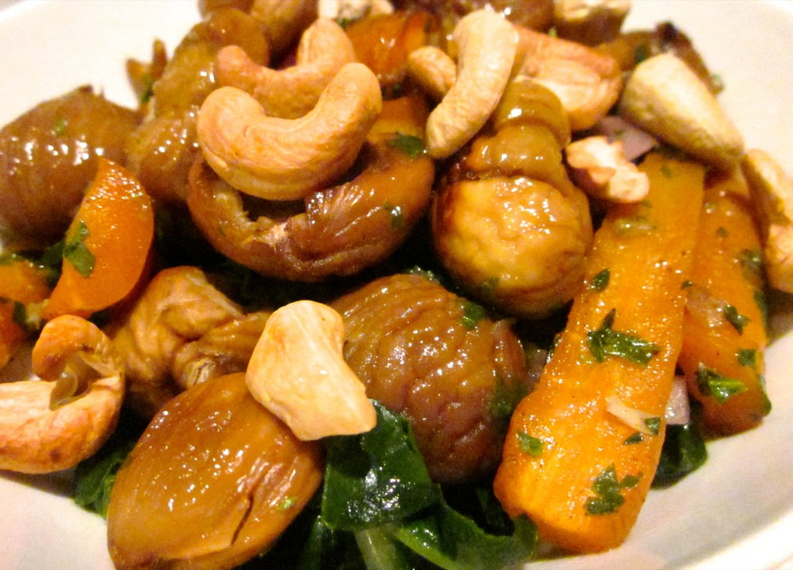

Hello and welcome to the latest episode of ‘What’s Left in the Fridge at the End of the Week?’ And the answer is: carrots, chestnuts, a bunch of silverbeet and some lemons. The lemons are still in the fridge, everything else went into this surprisingly successful creation that I’ll definitely be making again.

<!--more-->

Serves 4

  * 2 cloves garlic, finely chopped or crushed
  * 6 sprigs thyme
  * 6 sage leaves, finely chopped
  * 1/4 tsp cumin seeds
  * 1 tablespoon honey
  * 2 tablespoons dry sherry
  * 2 tablespoons olive oil
  * Salt and pepper
  * 2 bunches carrots
  * 500g chestnuts
  * ½ cup parsley, finely chopped
  * 1 red onion, finely diced
  * Large bunch silverbeet
  * 1 cup cashews, roasted

Preheat oven to 180˚C (350F).

Place cumin seeds in a skillet and cook over a low heat until they become fragrant. Don’t leave them unattended for long because they’ll quickly go from lightly toasted to burnt; I’d suggest removing the seeds from the heat when their scent becomes stronger, rather than waiting for them to appear brown.

Remove leaves from thyme and discard the stems. In a small bowl combine the thyme and sage leaves, garlic, cumin seeds, honey, sherry, 1 tablespoon of olive oil and a pinch each of salt and pepper.

Cut the carrots into sticks approximately 1 cm (½  inch) thick and toss through the spiced oil you just mixed up. Spread in a baking dish and bake until just tender, about 20 minutes.

Meanwhile roast and peel the chestnuts: Use a Stanley knife to cut a slice through the top (the pointy end) of each chestnut. Place on a tray and bake for 15-20 minutes until the skin starts to look a little crinkly or to split. Remove only a cup or so of chestnuts from the oven at a time as they’re easiest to peel while still quite hot. Peel the outer shell and inner skin from each chestnut. I wear a rubber glove on one hand but leave the other free as a balance between not getting burnt and maintaining a degree of dexterity.

Add chestnuts to the dish roasted carrots along with parsley and red onion. Toss to combine then return to the oven for about 5 minutes while you prepare the silverbeet.

Remove the stems from the silverbeet and coarsely chop the leaves. Heat 1 tablespoon olive oil in a frying pan over medium heat. Add the silverbeet and toss to coat with the oil. Cook, stirring frequently, until just wilted (if the oil is already hot this will only take a minute or two). Season with a pinch each of salt and pepper to taste.

You’re ready to serve: Divide the silverbeet between plates or bowls. Top with carrots and chestnuts and sprinkle with roasted cashews.
