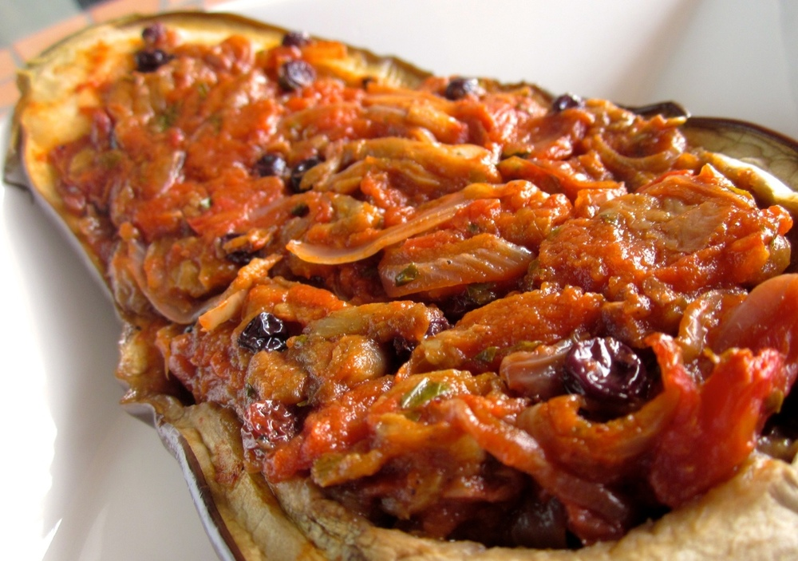

This is my take on the Turkish stuffed eggplant dish, which I’ve modified from Stephanie Alexander’s recipe in [The Cook’s Companion][cooks-companion]. If you’re after some procrastination, [Wikipedia][imam-bayildi] suggests a number of fanciful tales about how the dish got the name ‘imam bayildi’, which apparently translates as something about a priest fainting.

<!--more-->

This dish is best prepared a day in advance and allowed to sit overnight before serving. The first few times I made it temptation got the better of me and I served up one portion straight out of the oven, and put the rest away as suggested. After realising the imam bayildi was always better the next day, I have been making sure I’m more organised and leaving the whole dish to sit overnight (even if that means some simple [omelettes][omelettes] for dinner the first night).

Serves 4 when paired with a side.

  * 2 large, or 3 smaller eggplants
  * 1 kg tomatoes, peeled, cored and chopped * (or 800g tinned chopped tomatoes)
  * 1 onion, thinly sliced
  * 2 cloves garlic, finely chopped or minced
  * 1/2 cup fresh parsley, finely chopped
  * 1/4 cup currants
  * 1 bay leaf
  * generous pinch ground cinnamon
  * juice of one lemon (about 3 tablespoons)
  * salt
  * pepper
  * sugar (optional, to balance the tomatoes if needed)

*The Former Chef blog provides a good set of instructions on [How to Peel and Seed Tomatoes][peel-seed-tomatoes].

Preheat oven to 180˚ (350F).

Cut the eggplants in half lengthwise. Scoop out the flesh, leaving shells about 1 cm thick, or enough that they retain their shape. Sprinkle the cut side of the shells with salt and leave, face down, to drain for about half an hour. Chop the scooped out flesh; generally these pieces are somewhat haphazardly shaped, but as a guide go for about 1-2 cm in size. Sprinkle with salt and set aside to drain also.

Meanwhile, heat 1 tablespoon of olive oil in a frying pan, add onion and cook over a medium heat until soft and just starting to brown. Add garlic and cook for a minute or two longer until fragrant. Add the tomatoes, currants, parsley, bay leaf and cinnamon. Reduce to a medium-low heat and simmer until thickened, 20-30 minutes. Season with a pinch of pepper. Taste and add a little sugar (maybe 1/2 teaspoon) if the sauce is sharp. I generally don’t add any salt here, as the eggplant will retain some saltiness even after rinsing. Remove the bay leaf and transfer to a large bowl.

Rinse the eggplant flesh well and pat dry. (Depending on the size of your frying pan, you may like to do the following in two batches.) Rinse out the frying pan and heat  2 tablespoons olive oil over medium-high heat. Sauté the eggplant until tender and starting to brown, 10-15 minutes. Stir into the tomato sauce.

Rinse the eggplant shells and pat dry. Brush the skins with olive oil and arrange, face up in a baking dish. Divide the filling between the eggplant halves. Pour lemon juice into the baking tray around the eggplants, then fill the dish with enough boiling water to just come to the top of the lowest edge of the eggplants. Bake until eggplant is tender, 30-40 minutes.

Remove eggplant from the baking dish and allow to cool. Refrigerate overnight, and enjoy served at room temperature the next day.

 [peel-seed-tomatoes]: http://www.formerchef.com/2009/08/20/how-to-peel-and-seed-fresh-tomatoes/
 [cooks-companion]: http://www.amazon.com/The-Cooks-Companion-Ingredients-Australian/dp/1920989005%3FSubscriptionId%3D0ENGV10E9K9QDNSJ5C82%26tag%3Dfredel09-20%26linkCode%3Dxm2%26camp%3D2025%26creative%3D165953%26creativeASIN%3D1920989005
 [imam-bayildi]: http://en.wikipedia.org/wiki/Imam_bayildi
 [omelettes]: /2013/03/11/2013-3-11-omlettes/
