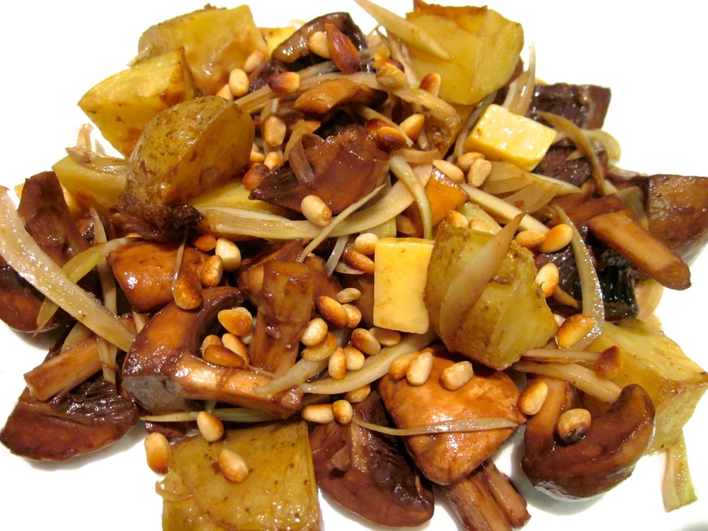

I like to serve this salad as an accompaniment to fish, especially a stronger-flavoured fish like salmon. There’s something about the combination of earthy mushrooms and slightly salty potato that just seems like a good match for fish to me. Add the fennel and you’ve got a nice seasonal salad for Autumn.

<!--more-->

Gruyère cheese works very well in this dish, but it’s quite expensive and I don’t tend to keep it on hand, so I’ll often just use cheddar which is also tasty.

For a nut-free version, skip the pine nuts and replace the peanut oil with canola oil. For a dairy/lactose-free or vegan salad, omit the cheese.

Serves 3-4 as a side

  * 400g mushrooms, quartered, halved or left whole, depending on size
  * 1 bulb baby fennel, trimmed, quartered, cored and finely sliced
  * 600g potatoes (I really like dutch cream, but any white potato will do)
  * 100g cheddar or gruyère cheese, cut into 1cm cubes
  * 2 tablespoons pine nuts, toasted
  * 2 tablespoons balsamic vinegar
  * 3 tablespoons olive oil
  * peanut oil
  * salt
  * pepper

Combine the balsamic and olive oil in a medium bowl along with a pinch each of salt and pepper. Add the mushrooms and mix until the mushrooms are well coated with the vinaigrette. Add the fennel, toss to combine and set aside to marinate for at least 30 minutes.

Meanwhile, boil the potatoes until just tender – firm enough that they still retain their shape. You’ll be cooking them further under the grill so try not to over cook them here. Drain, pat dry and cut into 2cm cubes. Toss with just enough peanut oil to lightly coat the potatoes. Heat grill or broiler (or you can use a hot oven). Spread potatoes on a tray in a single layer and sprinkle lightly with salt. Place under grill or broiler and cook until golden and crispy, 10-15 minutes.

To serve, combine mushroom and fennel with potatoes and cheese, and sprinkle pine nuts over the top.
