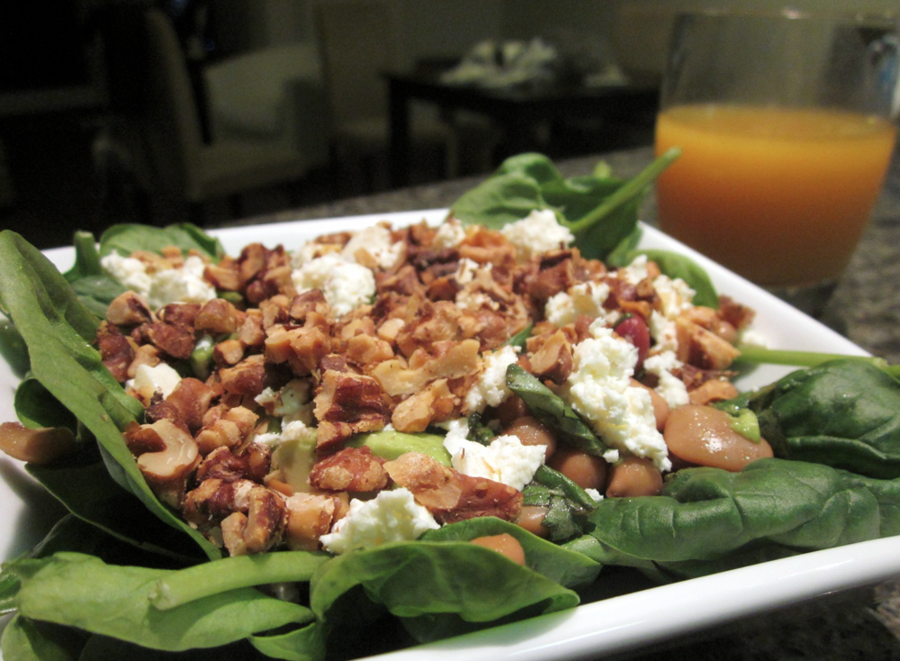

Sitting down to write my first post and a natural starting point is my all time favourite recipe to share with people. How did this recipe earn its status? Well, it’s one of our favourites to eat because it’s super tasty and packed full of nutrients, and at the same time is really quick and easy to prepare.

<!--more-->

Serves 4-5

  * 1/2 cup walnuts, roasted and coarsely chopped
  * 800g tin mixed beans, rinsed and drained (I like the Edgell Four Bean Mix. An alternative to tinned beans is to use about 1 cup dry beans, soaked overnight, boiled and drained).
  * 1/2 red onion, finely diced
  * 2 avocados, cut into 1/2 inch cubes
  * 80 grams fetta
  * 1 1/2 tablespoons balsamic vinegar
  * 3 tablespoons olive oil
  * a few pinches each salt & pepper
  * a few sprigs basil &/or oregano, finely chopped (optional)
  * 4 cups baby spinach

In a bowl, combine beans, onion, balsamic vinegar, olive oil, salt, pepper and herbs if using. Adjust the balsamic, olive oil and seasoning to taste. Add the avocado. Salad can be prepared to here in advance and refrigerated (the avocado will keep as long as it’s well coated with the vinaigrette). To serve, distribute the baby spinach between serving bowls and spoon the bean and avocado mix over the top. Sprinkle with walnuts and crumble fetta over the top. I generally have this with a glass of juice, or follow with a piece of fruit, as the extra vitamin C helps with absorption of the iron from the spinach and beans. Enjoy!

