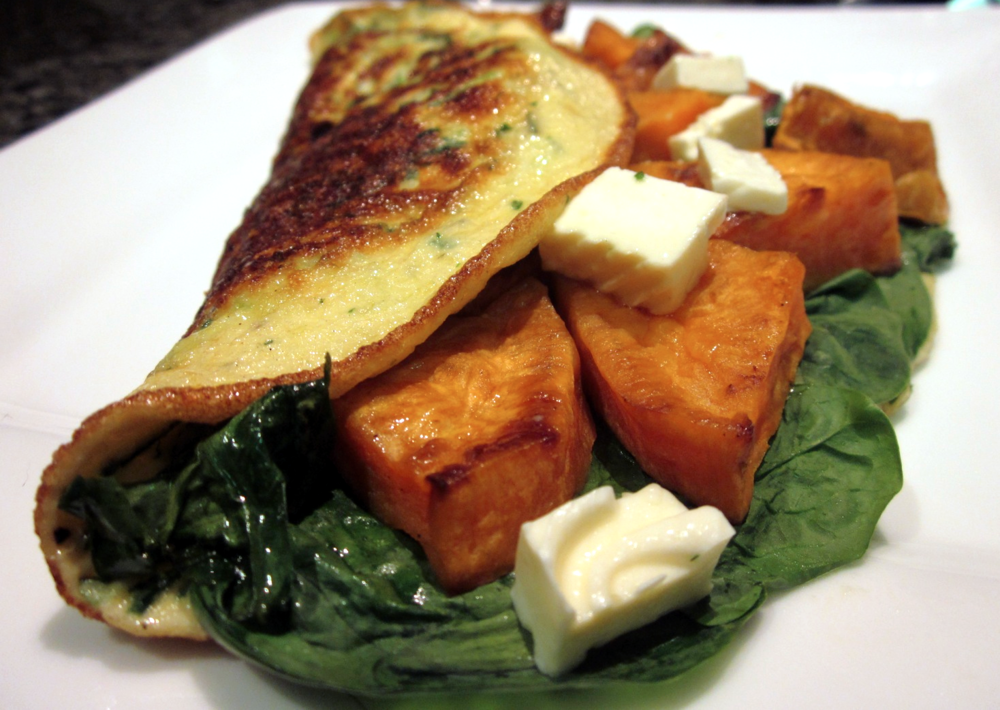

This is definitely one of our go-to recipes. Omelettes are quick, easy, tasty, healthy, and the ingredients are flexible depending on what’s on hand, which makes them a great weeknight dinner option.

<!--more-->

You can really play around with whatever takes your fancy for the omelette fillings. I prefer to add most of the fillings after the omelette is cooked, keeping the base quite thin, but don’t hesitate to play around with this too. For a flavourful varient, try adding some finely chopped sun-dried tomatoes and fresh oregano or thyme to the egg mix.

Per omelette:

  * 2 eggs
  * 1/4 cup freshly grated cheese, I generally use parmesan, but cheddar or any other hard cheese also works
  * 2 tablespoons milk
  * 2 shallots/scallions, finely sliced
  * salt & pepper
  * fresh herbs, finely chopped (optional, depending on what you have. Chives, parsley, basil, etc. work well)
  * olive oil
  * extra grated cheddar for sprinkling (optional)
  * Fillings – see below

Whisk the eggs in a small bowl. Add the 1/4 cup cheese, milk, shallots, salt, pepper and herbs, if using, and mix to combine.

Heat a non-stick frying pan over a medium heat. Coat pan with a little olive oil. Pour omelette mixture into pan and swirl to distribute evenly. If you’re a cheese-aholic, go ahead and sprinkle some extra grated cheddar over the top.

Cook until golden brown on the bottom – use a spatula to take a peek at the underside – and set on top, about 5-10 minutes.

Spoon fillings in a semi-circle over half the omelette. Season with salt and pepper to taste. Fold the other half of the omelette over the top, and slide onto a plate to serve.

Some of our favourite omelette fillings are:

  * Sweet potato, boiled, grilled or baked, with baby spinach and fetta cheese.
  * Baked or boiled potato with rosemary (this is great comfort food).
  * Sautéed garlic, mushrooms and asparagus.
  * Grilled Mediterranean vegetables, e.g. zucchini, capsicum, tomatoes and red onion, with fetta cheese. 
