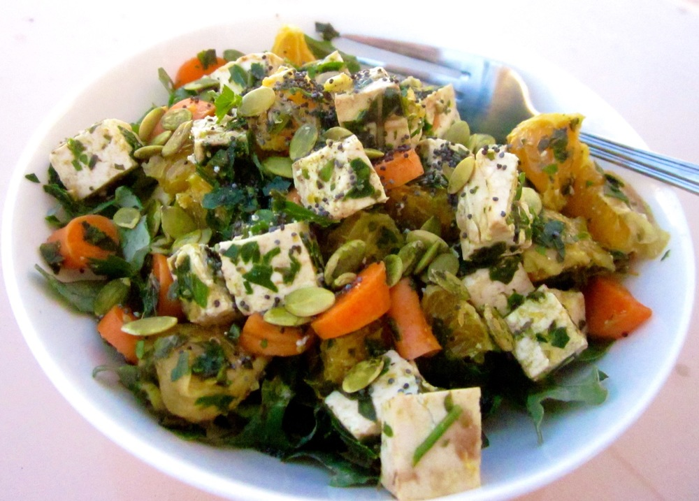
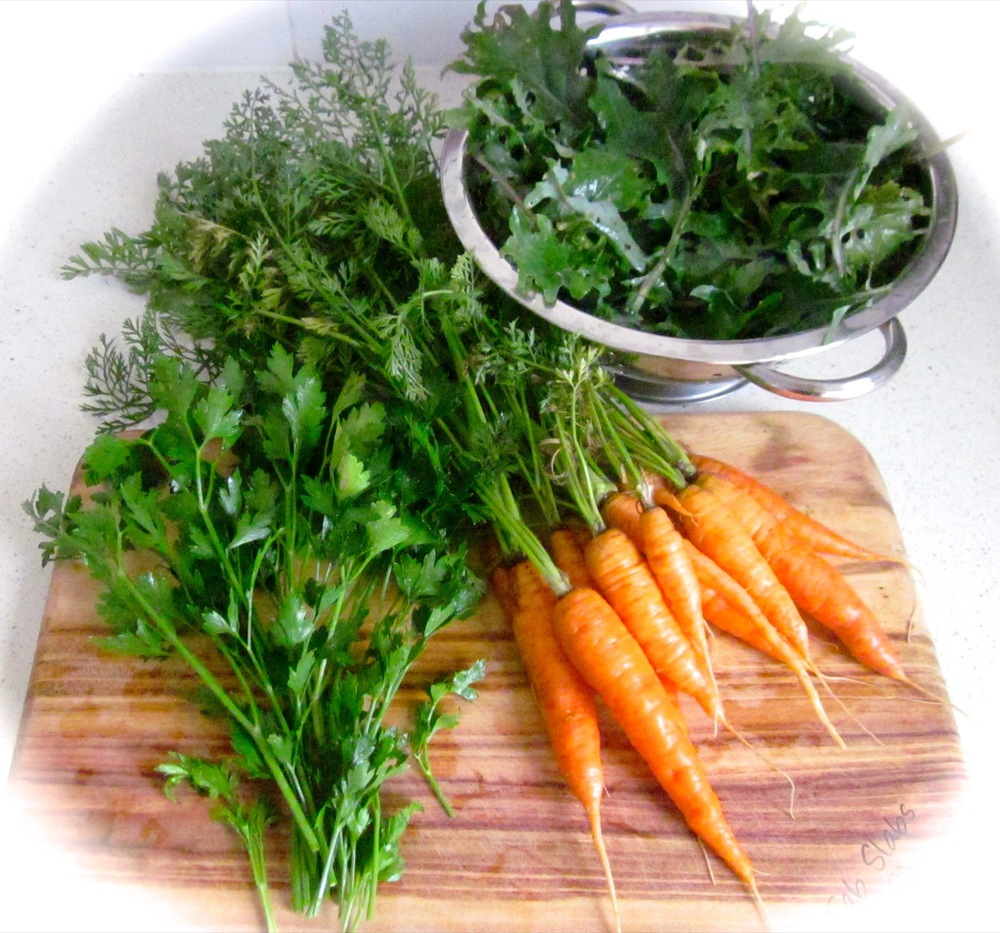

Summer has arrived and doesn’t the warmer weather just make it so much easier to eat well?! Here’s another idea for a refreshing and tasty salad to enjoy and feel good about. To my readers in the Northern hemisphere, the key fruit and vegetables: oranges, carrots and leafy greens, are in season during winter too, and it’s never the wrong time of year to eat well!

<!--more-->

This salad is super fresh and simply dressed, it’s all about letting quality ingredients shine through. So, a few pointers:

  * Save the slightly saggy week-old carrots sitting in the bottom of your fridge’s crisper for stock or juice and buy (or dig!) a fresh bunch.
  * Now’s the time to splash out on good quality tofu; you’re not going to be cooking it or hiding it under any sauces here so it’s worth an extra couple of dollars for the organic option.
  * When I used to think of olive oil I thought of Italy, but it turns out Australia produces its own great olive oils here at home. In fact, my favourite: [Homeleigh Grove’s][homeleigh-grove] [‘Lowanna’s Paddock’][olive-oil], a Robust extra virgin olive oil, [was recently awarded first place in a Southern hemisphere international competition][olive-award]! So next time you’re shopping for olive oil, why not try buying local: if you’re lucky enough to have a farmers’ market near by, that’s a good bet, otherwise IGA supermarkets are pretty good at stocking local products too.

Did I mention fresh was the key here? I’m a bit proud of our little veggie garden lately which has become quite productive; you can’t get much fresher than picked 15 minutes ago! In case you were wondering, here’s the before photo: spring harvest of homegrown parsley, carrots and kale…

This salad is good prepared and served straight away, but if you’re the oranised type it doesn’t hurt to let the tofu ‘marinate’ with the oranges and herbs in the fridge for a few hours – just see the guidelines in the recipe below.

If seeds may be an allergen for you or someone you’re feeding, just leave them off the salad, the fresh carrots will still add a nice crunch. The basil is a nice addition and works well with the other flavours, but I’ve also made it with just the parsley if I haven’t had basil on hand.

Serves 5

  * 400-500g firm tofu
  * 3 navel oranges (other varieties will work too, just be sure to remove the pips)
  * Small bunch parsley (approximately 1 cup, loosely packed)
  * Optional: a few sprigs fresh basil (approximately ½ cup, loosely packed)
  * 1 bunch baby (also known as ‘Dutch’) carrots (regular ‘adult’ carrots will work too, if that’s what’s available)
  * 1 bunch kale, silverbeet, spinach or other dark leafy green
  * 2 teaspoons poppy seeds
  * ⅓ heaped cup pepitas (pumpkin seeds)
  * ¼ cup olive oil
  * salt and pepper to taste

Cut the tofu into 1 cm  (½ inch) cubes and place in a large bowl. Peel the oranges, cut into bite-sized pieces and add to the tofu. Remove the parsley and basil (if using) leaves from their stems. (You can discard the stems). Finely chop the leaves and add to the tofu and oranges. Add just a few pinches each of salt and freshly ground black pepper, to taste. Mix well to combine ingredients. If you’re preparing this in advance stop here, cover and store in the fridge until you’re just about ready to serve.

Cut the carrots into small pieces (less than 1 cm, or about ¼ inch in size). Toss through the salad.

Remove any tough, fibrous stems from your leafy greens. Coarsely chop or tear the leaves and use these to line serving bowls. Spoon the tofu mix over the greens and drizzle with olive oil (a few teaspoons per serve). Finally, sprinkle with poppy seeds (about ½ teaspoon per serve) and pepitas (about 1 tablespoon per serve). Important: don’t add the seeds until you’re ready to serve the salad, it will keep them nice and crunchy. Enjoy!
 

 [homeleigh-grove]: http://www.homeleighgroveolives.com.au/index.html
 [olive-oil]: http://www.homeleighgroveolives.com.au/OliveProducts.htm
 [olive-award]: http://www.irvea.org/in-evidenza/nz-sa-2014-awards-ceremony/