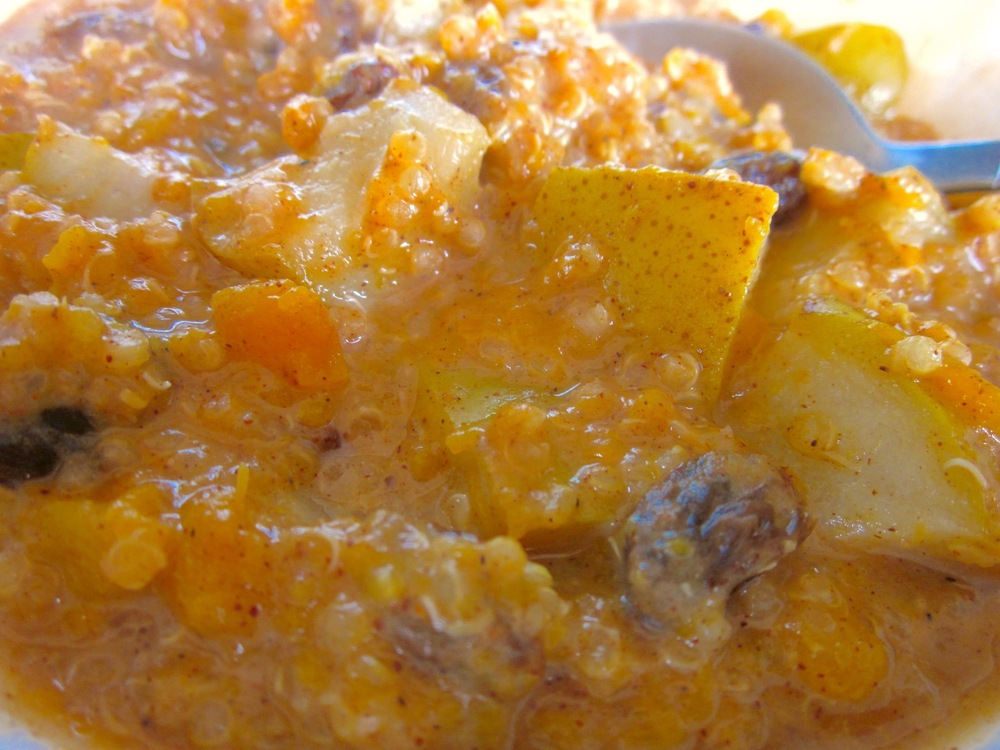

Being a porridge, this is a lovely warm and sweet breakfast or brunch dish, but I did have it for dinner the other night when I was feeling in need of something cosy. I’d had a nap in the afternoon and woke up feeling more groggy than refreshed and thinking that if I was going to cook dinner it had better be particularly comforting and not too involved. So, I made this pumpkin quinoa porridge, and it has rapidly become a regular at my table.

<!--more-->

The recipe is based on one from the [With Food + Love][with-food-love] blog by Sherrie Castellano. 

The pumpkin puree and quinoa can be cooked in larger batches in advance and kept in the fridge for a few days, making it super quick and easy to throw this together for breakfast on a chilly morning.

For a dairy/lactose-free version, use soy or other non-dairy milk. For a vegan alternative, use a non-dairy milk and replace the honey with agave nectar or maple syrup.

Serves 2

  * 1/3 cup quinoa (makes about 1 cup when cooked)
  * 1cm piece cinnamon stick
  * 1 cardamon pod
  * 2 cloves
  * 1 pear or granny smith apple, cored and cut into 1-2cm cubes
  * 2/3 cup [pumpkin puree (recipe below)](#pumpkinpuree)
  * 1/2 cup milk
  * 1/3 cup sultanas
  * 1/4 teaspoon vanilla extract (or seeds scraped from 1/4 vanilla pod)
  * 1/2 teaspoon ground cinnamon
  * a few pinches ground nutmeg
  * 1 teaspoon honey

Combine quinoa, cinnamon stick, cardamon and cloves with 2/3 cup boiling water in a saucepan over medium-low heat. Simmer until quinoa is tender and water absorbed, 15-20 minutes. Add a little extra water if needed while cooking. Once quinoa is cooked, remove from stove and fish out the spices.

Place pear or apple in a small microwave safe bowl, and add enough boiling water to barely cover the fruit. Microwave for 3-5 minutes until tender, then drain. A ripe pear will be done in 3 minutes, while a firmer pear or an apple will need 4-5 minutes.

Add pear or apple, pumpkin puree, milk, sultanas, vanilla, ground spices and honey to the quinoa. Add a little extra milk if needed. Return to the stove and cook over medium heat, stirring occasionally, until hot. Adjust spices and honey to taste and serve immediately.

###  Pumpkin puree

Quantity will depend very much on the size of your pumpkin. Many recipes will only call for a small fraction-of-a-pumpkin-worth of puree, but I usually cook half or the whole pumpkin and keep the extra on hand in the fridge. I’ve suggested two methods for cooking the pumpkin below: boiling/steaming requires more ‘hands-on’ time, but will cook the pumpkin more quickly; roasting the pumpkin will take an hour or two, but it only needs about 5 minutes of your time, so you can do something else while the pumpkin’s cooking. Personally I prefer roasting, it just means being a bit organised.

  * 1 butternut pumpkin
  * olive oil (if roasting)

Cook the pumpkin:

To boil/steam: Peel and seed pumpkin and cut into 2cm cubes. Boil or steam until pumpkin is very tender, then drain.

To roast: Preheat oven to 180˚C (350F). Cut pumpkin in half lengthwise and scoop out the seeds. Brush cut sides lightly with olive oil. Place, cut sides down, on a baking tray and roast until pumpkin is very soft. This will take about 1.5 hours although cooking time will vary depending on the size of your pumpkin. You can test if the pumpkin is cooked through using a skewer. Peel the skin away from the pumpkin (or if it’s not coming away easily, turn pumpkin halves over and scoop out the flesh).

Puree the pumpkin flesh either with a potato masher/fork or in a food processor. In the case of the latter, it’s generally a good idea to allow the pumpkin to cool slightly before processing. Using a food processor will give you a smooth puree, while mashing by hand will result in a ‘chunkier’ consistency.

 [with-food-love]: http://withfoodandlove.com/breakfast-brunch/first-of-fall/