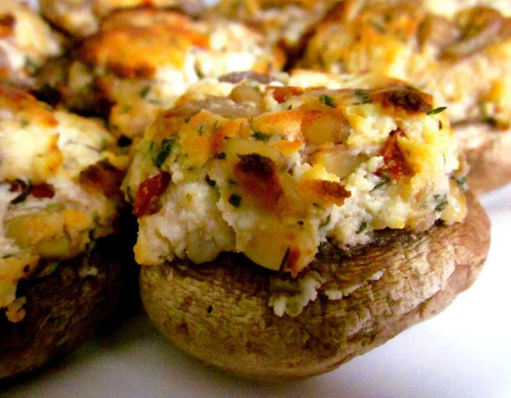

If you’re in Australia at the moment, chances are you’ve got a barbecue or three coming up. If you’re in cooler climes, then you might be looking for cosy dishes to bake. Either way, these stuffed mushrooms fit the bill; talk about versatile!

<!--more-->

Lately I’ve been using largish button mushrooms in this recipe, as they’re the perfect size for sharing. If you’re after meal-sized servings though, try using portobello mushrooms instead.

These mushrooms can be baked, grilled or barbecued – the preparation is all the same.

For a super-quick variant, just mix the ricotta and sun-dried tomatoes with salt and pepper to taste, perhaps add some dry herbs if they’re handy, pile on top of portobello mushrooms and add to the barbie.

For a nut-free version, skip the pine nuts.

Makes 12 pieces

* 12 medium-large button mushrooms (or 3-4 portobello mushrooms)
* 2 cloves garlic, finely chopped
* 1 tablespoon olive oil
* 300g ricotta
* 1/4 cup sun-dried tomatoes, drained and chopped
* 2 tablespoons pine nuts, toasted
* 2 tablespoons fresh oregano and/or thyme leaves, finely chopped
* salt and pepper

If baking, preheat oven to 180˚C (350F).

Remove stems from the mushrooms and coarsely chop, discarding any woody bits. To remove the stem of a mushroom: hold the mushroom in one hand and use your other hand to pinch the stem, squeezing so the stem splits. Pinch the two halves of the stem together and squeeze so it’s now split into four pieces. Now twist the stem, and it should come easily away from the mushroom.

Heat olive oil in a small skillet over medium heat. Add mushroom stems and garlic and sauté until garlic is fragrant and stems are lightly browned.

Wrap ricotta in paper towels or cheese cloth and squeeze to remove excess liquid.

Combine mushroom stems, ricotta, sun-dried tomatoes, pine nuts and fresh herbs in a bowl and mix to combine. Season with a few pinches of salt and pepper to taste.

If using portobello mushrooms, sprinkle the underside of the mushrooms lightly with salt and pepper. Skip this step if using button mushrooms (I think it’s too fiddly and you’ve already seasoned the stuffing).

Place mushrooms on a baking tray, skin-side facing down, and fill with the ricotta stuffing. Your mushrooms are now ready to cook, but cooking time will depend on the size of your mushrooms and method of cooking. Small mushrooms will cook in 10 minutes under a grill, portobello mushrooms may take 30-40 mins to bake. As a guide, check button mushrooms after 10-15 minutes, and portobello mushrooms after 20-30 minutes. The mushrooms will be ready when the ricotta is golden-brown and the mushroom is heated through.
