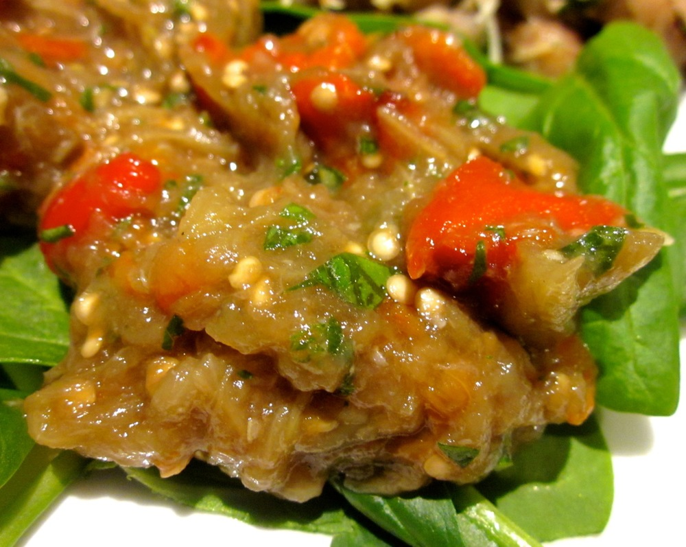

This isn’t quite quick, due to the cooking time required, but it is dead easy to make, and oh so yummy. It’s a great option as a side when you’re preparing something else which is a bit involved, as this will take little effort from you and can cook in the mean time.

<!--more-->

You could also try serving this sprinkled with pine nuts and/or goat’s cheese.

Serves 4 as a side

  * 1 large eggplant, cut in half lengthways
  * 1 large red capsicum
  * 1 head garlic (unpeeled)
  * 1/2 cup fresh basil, finely chopped
  * 2-3 tablespoons balsamic vinegar
  * olive oil
  * salt
  * pepper
  * 2 cups baby spinach

Preheat oven to 200˚C (390 F).

Sprinkle cut sides of eggplant with salt and set aside, cut side down, to drain for at least 30 minutes.

Meanwhile, brush garlic lightly with olive oil and place it and the capsicum on a baking tray and cook until the skin on the capsicum has blistered and the garlic is tender, about 30 minutes. Turn the capsicum during cooking so the skin blisters on all sides. Set garlic and capsicum aside until cool enough to handle.

Rinse eggplant well and pat dry then brush the cut sides with olive oil. Place eggplant on a baking tray, cut sides face-down. Bake until eggplant is very tender (the skin will also be slightly crinkly), about 30-40 minutes.

Squeeze garlic out of its peel and into a bowl. Peel and seed capsicum, pat dry and finely dice, then add to the garlic. Peel eggplant skin away from the flesh (or if it’s not coming away easily, scoop flesh out with a metal spoon). Finely dice eggplant flesh and add to the bowl. Add the fresh basil, along with the balsamic, 1 tablespoon olive oil and a pinch each of salt and pepper. Adjust the vinegar and seasoning to taste.

Serve warm or at room temperature, spooned over the baby spinach.
