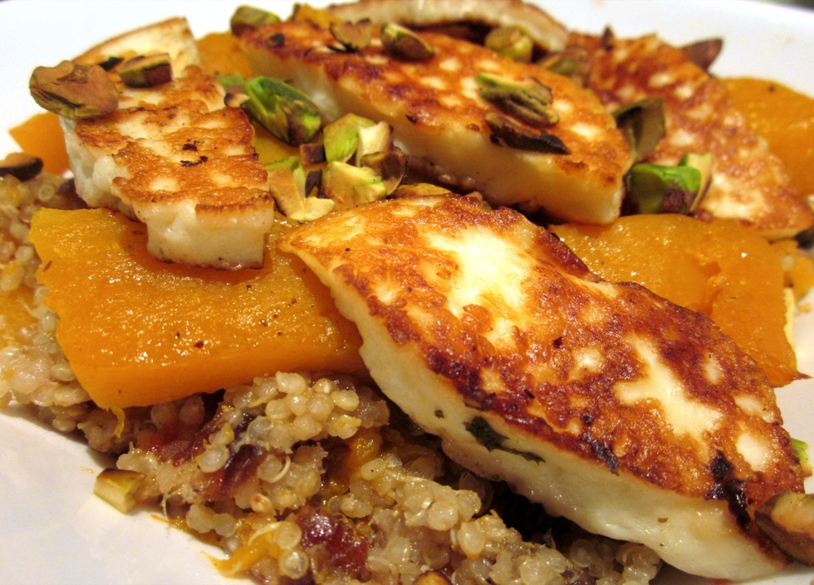

This is one of those dishes that you look at and ask “umm, really?” but yes, this really does work. The sweetness of the pumpkin and dates and the saltiness of the halloumi and pistachios complement each other perfectly, and the result is simply delectable. While I would like to be able to claim credit for the idea of cooking quinoa in peppermint tea, it actually came from a cous cous recipe in [Tea Cookbook][tea-cookbook] by Tonia George.

<!--more-->

For a nut-free version, just omit the pistachios

Serves 4-5

  * 1 small-medium butternut pumpkin, half cut into 2cm cubes, and the other half sliced into roughly 1cm x 3cm x 10cm slices (or keep things simple and just cube the whole lot).
  * 1 head garlic, kept whole
  * 1 cup quinoa
  * 2 cups peppermint tea (that’s 2 cups of prepared tea, NOT 2 cups of tea leaves!)
  * 10 fresh dates, pitted and finely diced
  * 1/4 cup pistachios, coarsely chopped and toasted
  * 250g halloumi cheese, cut into 5mm thick slices
  * 6 bay leaves
  * 6 sprigs fresh thyme
  * olive oil
  * pepper

Preheat oven to 180˚C (350 F). Lightly grease two baking trays with a olive oil. Spread cubed pumpkin on one baking tray and add the head of garlic. Toss with a little more olive oil, season with pepper and distribute half the bay leaves and thyme over the pumpkin. Arrange sliced pumpkin on the other tray, drizzle over a little extra olive oil, season with pepper and add remaining herbs. Bake until pumpkin and garlic are tender, and pumpkin is lightly brown. Turn the pumpkin half way through cooking. I find the total time to roast a tray of pumpkin and garlic like this is about 30 minutes, however with two trays our oven cooks much more slowly and it can take 40-50 minutes. (If I’m getting really impatient I’ll turn the oven up to 200˚C/390F to brown the pumpkin.)

Meanwhile, cook the quinoa: Combine quinoa and 1 3/4 cups of the peppermint tea in a saucepan over medium heat and bring to the boil. Reduce heat and simmer until tea is absorbed and quinoa tender. If needed, add a little extra tea or hot water while cooking. You can tell the quinoa is cooked because the little rings around the outside of the seed will start to separate from the central part.

Mix together quinoa, cubed pumpkin (or half, if you’ve cubed the whole lot) and dates. Squeeze out the roast garlic. The easiest way I’ve found to do this is to slice off the bottom of the garlic head and, wearing rubber gloves (especially if the garlic is still hot) squeeze until all the garlic comes out. Mix this into quinoa.

Cook the halloumi: Heat a frying pan over medium-high heat. You want the pan to be nice and hot before you add the halloumi, so that the surface browns before the cheese melts into a blob. Unless you’re using a non-stick frying pan (or if you are but the teflon coating is starting to go), you may like to add a very small amount of olive oil to coat the pan. If you do use oil, do so sparingly because the halloumi will release its own fat as it cooks. Add the halloumi and cook until lightly golden brown on the underside, only 1-2 minutes. Turn over, and cook until the other side is also golden, about another minute. 

To serve: Spoon quinoa mix into bowls, top with pumpkin slices and halloumi and sprinkle pistachios over the top.

 [1]: http://static1.squarespace.com/static/5131e8dce4b03f8a261bd212/5131e8dce4b03f8a261bd222/5162c052e4b0715db6229ebe/1365426260504/quinoa+pumpkin+halloumi+edited+resized.JPG
 [tea-cookbook]: http://www.amazon.com/Tea-Cookbook-Savory-Recipes-Lovers/dp/B0064XC8AM%3FSubscriptionId%3D0ENGV10E9K9QDNSJ5C82%26tag%3Dfredel09-20%26linkCode%3Dxm2%26camp%3D2025%26creative%3D165953%26creativeASIN%3DB0064XC8AM