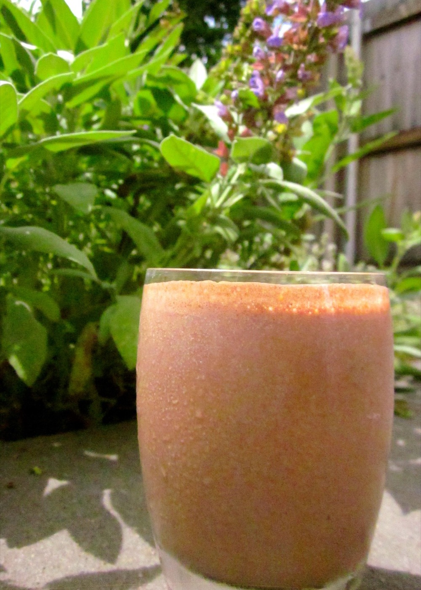

Deliciousness in a glass! I mean seriously, who needs junk food when you can make treats like this that are made with proper food and contain real nutrients while also making your taste buds super happy?!

<!--more-->

For vegan and dairy/lactose free alternatives, use soy or other non-dairy milk and either skip the yoghurt or try replacing it with silken tofu or non-dairy yoghurt.

Serves 1

  * 1 banana, peeled and cut into chunks
  * ¼ cup skim milk
  * 2 tablespoons peanut butter
  * 2 tablespoons natural yoghurt
  * 1 teaspoon cocoa powder
  * ½ cup ice blocks (adjust depending on how cold you’d like your smoothie, alternatively use frozen banana and skip the ice).

Combine all ingredients in a blender and blend until smooth. Enjoy!
