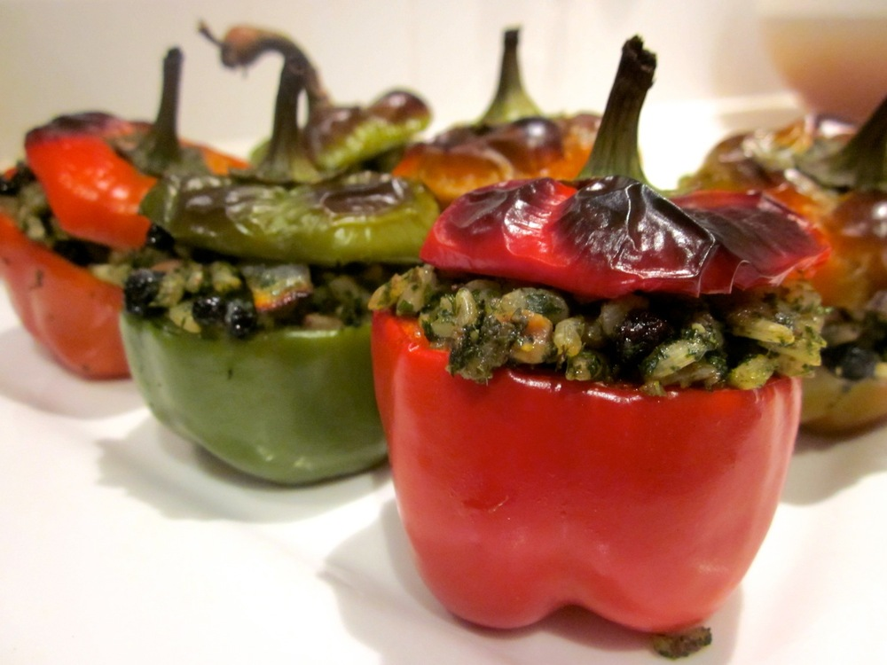
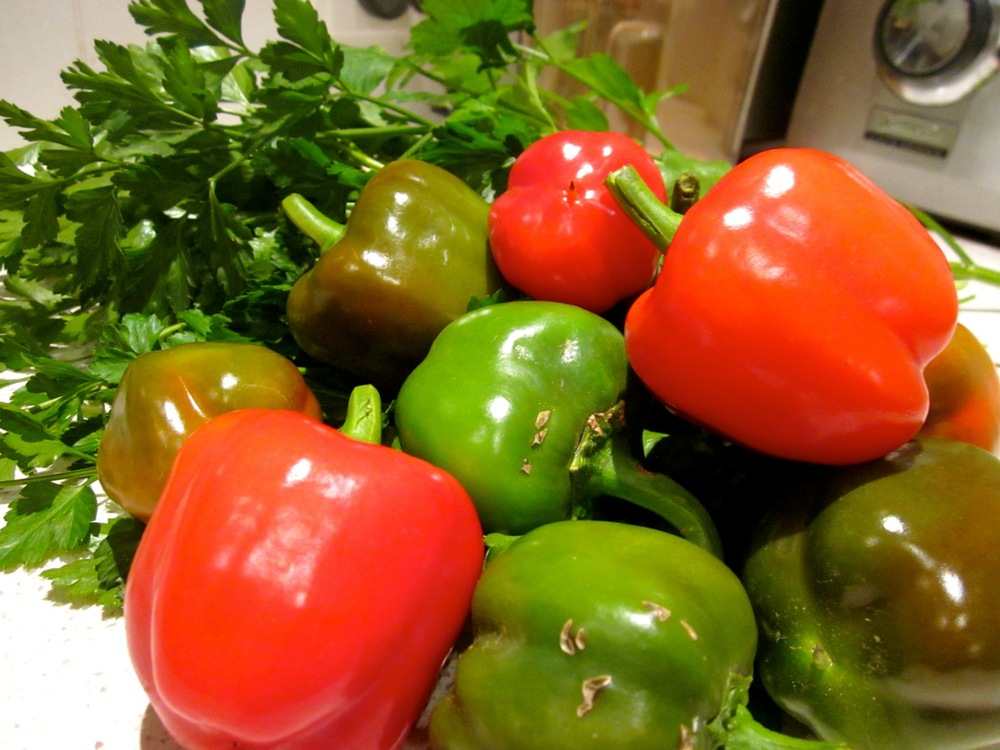

It is possible to overdose on parsley? This is the question my partner’s been asking as he shares his suspicions that I’m trying to poison him with the herb, we’ve been eating that much of it lately! No, I don’t have a weird parsley obsession or craving (and I most certainly am not trying to poison anyone), we just have two parsley plants that are on a mission to take over the world, starting with our veggie garden. In a battle that’s been ongoing for several months now, I’m starting to get the upper hand, in large part thanks to regular batches of [parsley pesto](#parsleypesto).

<!--more-->

I was quite proud of these [stuffed capsicums](#stuffedcapsicums) because they centred around ingredients picked fresh from our garden: the parsley, of course, and also the sage and this delightful harvest of capsicums:

}

Enjoy these stuffed capsicums by themselves or pair with a dose of protein, perhaps eggs or baked fish, for a complete meal. If you’re entertaining, the capsicums can be prepared and stuffed in advance. Store them in the fridge in an airtight container. Take them out an hour or so before baking so they can come to room temperature, or allow a bit of extra baking time if they’re still cold.

For a nut-free version, omit the walnuts when making the pesto. For a vegan or dairy free version, the pesto is still very good without the parmesan (and I’ll sometimes make it without cheese if we’ve run out at home).

###  Stuffed Capsicums

Serves 4 as a side or light meal

  * 4 capsicums
  * ⅓ cup brown rice
  * 1 brown onion, diced
  * 2 cloves garlic, finely diced or chopped
  * 6 leaves fresh sage, finely chopped
  * ¼ cup currants
  * olive oil
  * salt
  * pepper
  * ⅓ cup [parsley pesto (recipe below)](#parsleypesto)

Preheat oven to 180˚C (350F). Brush a baking dish large enough to hold all the capsicums lightly with olive oil.

Add the brown rice and ¾ cup water to a saucepan and bring to the boil over a medium heat. Reduce heat to low and simmer until water is absorbed and rice tender, adding a little more water during cooking if needed.

Meanwhile, behead the capsicums (i.e. slice the tops off so you have the capsicum with a ‘lid’). Use a spoon to scoop out the seeds; rinsing under running water can also help clear away loose seeds. Set aside for later use.

Heat 1 tablespoon olive oil in a frying pay over medium head and add the onion. Cook, stirring frequently, until onion softens. Add the garlic and sage and cook for another minute or two.

In a bowl stir together the onion mixture, rice, currants, and parsley pesto. Taste and season with salt and pepper to taste.

Spoon stuffing into the capsicums and top with the lids. If you have left over filling it makes a tasty snack or part of lunch the next day. Arrange capsicums in the baking dish and bake until capsicums are cooked and stuffing is heated through, about 30 minutes. Enjoy!

###  Parsley Pesto

Makes about 3/4 cup

  * large bunch flat-leaf parsley
  * 1/4 cup walnuts, toasted
  * 2 cloves garlic, unpeeled
  * 3-6 tablespoons olive oil (exact quantity will depend on how much parsley you have and on the blender you’re using).
  * salt
  * pepper
  * 1/4 cup grated parmesan

Preheat oven to 180˚C (350F) and roast garlic for about 20 minutes, until tender.

Add parsley and 2-3 tablespoons of olive oil to a blender or small food processor (I’ve found my stick blender works best). Process until finely chopped and if parsley does not blend well add more oil. You may also need to stop the blender and scrape down the sides.

Peel the garlic and add it, the walnuts and a pinch each of salt and pepper. Process until you have a paste-like consistency.

Add the parmesan and process briefly to combine. Taste and adjust seasoning as needed.

This will keep stored in the fridge for about a week. The colour may darken a little but it still tastes just as good.
