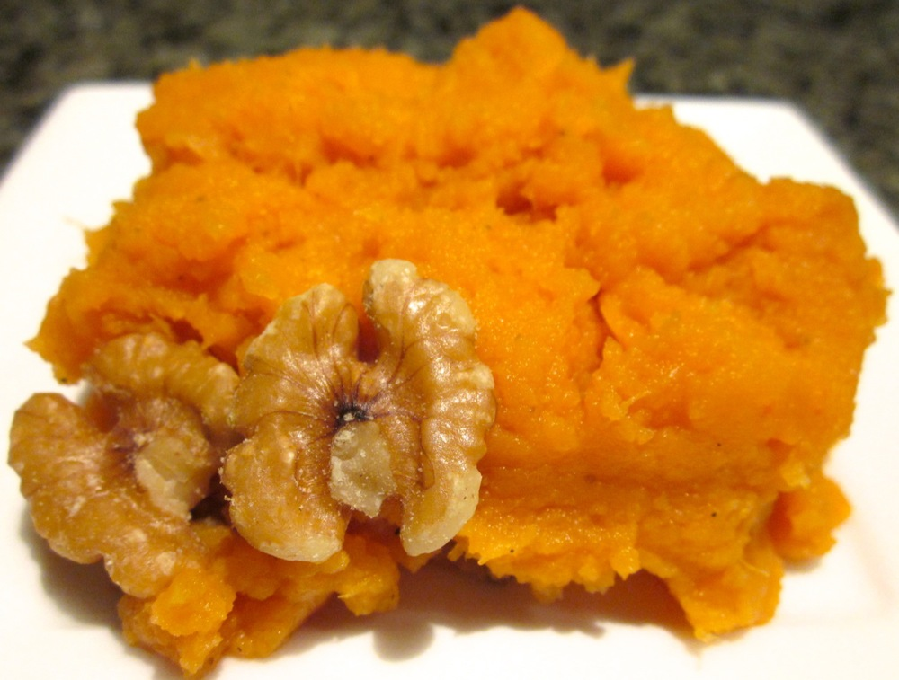

Sweet potato mash provides a more flavourful alternative to the traditional ‘white’ mashed potato, without the need for copious quantities of butter. This version is quite rich and creamy, with the added warmth of the nutmeg, so would complement something nice and fresh, or a bit zesty. It also makes for some great comfort food.

<!--more-->

Serves 4 as a side

  * 1 large (700-800g) sweet potato, peeled and cut into 2cm cubes
  * 1/4-1/2 cup milk (or, for a dairy/lactose-free version, use soy or other non-dairy milk)
  * 1/2 cup walnuts or pecans, coarsely chopped and toasted (optional, they add a nice crunch but of course omit for a nut-free version)
  * pinch ground nutmeg
  * salt
  * pepper

Steam or boil sweet potato until very tender (and, if boiled, drain). I prefer steaming because it doesn’t leach as much of the nutrients from vegetables as boiling does. Mash with a potato masher first, then I like to go over it with a fork for a smoother consistency. Stir in 1/4 cup milk and check the consistency. If the mash is nice and smooth, leave it there, if it’s still a bit dry, add a little more milk. Mix in the nutmeg and season with a pinch each of salt and peper. Stir through the walnuts and serve immediately.
