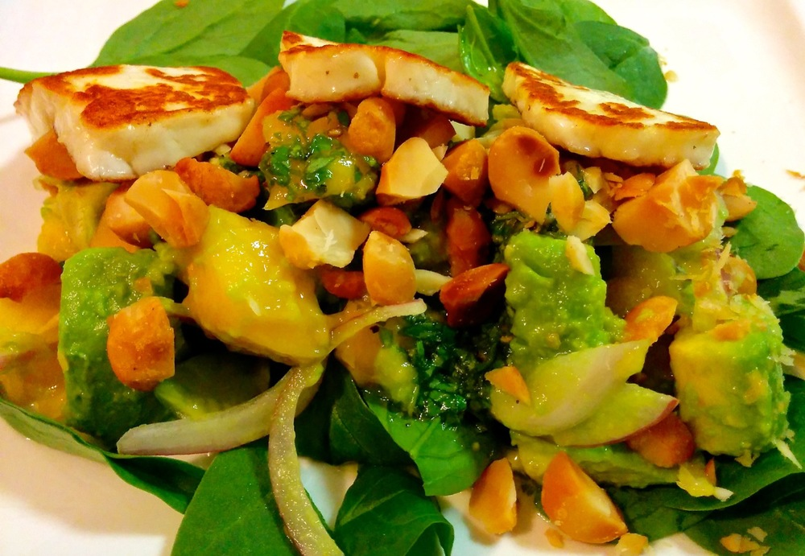

I tend to get a little concerned when I hear the ‘vegetarian’ conversation going on in the background while I’m cooking. It goes something like this: my partner being quizzed by our dinner guest along the lines of “so are you vegetarian too?”, “do you always eat vegetarian meals?”, “do you mind not eating meat at home?”, “what about protein?”, etc., etc. Fast forward an hour or two and said guest has not only complemented the meal but scraped his plate clean and even volunteered to do the washing up (actions speak louder than words)… I think maybe I’ve changed someone’s mind on vegetarian cooking!

<!--more-->

This recipe came about by combining a mango and halloumi salad suggestion from my good friend Tegan, with a mango and avocado salad recipe from [Joy of Cooking: All About Vegetarian Cooking][joy-of-cooking] by Irma Rombauer et al., along with some tweaks of my own. If you’ve tried my recipes before, hopefully you’ve learned that even (or especially) when you read an ingredients list and the words “unlikely combination” come to mind, the result is going to be good. If you’re new to my blog then trust me, this is worth being a little adventurous!

I often include eggs with the salad to turn in into a complete meal, but I also like serving it without the eggs alongside panfried fish or to add a bit of ‘wow’ factor to a spread. The number of eggs is also easily varied according to appetite: after something slightly lighter? make it 1 egg per person, feeding a hungry man after a big training session? pile on some extra eggs and maybe add a side with more carbs.

For a nut-free version, skip the macadamias. For a vegan and dairy/lactose free salad, leave out the eggs and halloumi and the resulting mango and avocado salad is still a great combination!

Serves 4

  * ½ cup macadamia nuts
  * 1 lemon, juiced (around 3 tablespoons lemon juice)
  * 2 avocados
  * 2 small-medium mangoes or 1 large
  * ½ red onion
  * 2 or 3 tablespoons olive oil (use 3 tablespoons if you’re including eggs, otherwise just use 2)
  * salt and pepper
  * ¼ cup fresh basil, finely chopped
  * 4 cups baby spinach
  * 8 eggs (optional)
  * 200g halloumi

Preheat oven to 160˚C (320 F). Coarsely chop the macadamias then spread on a baking tray. Bake in oven until macadamias are fragrant and lightly toasted. If your oven is preheated this will only take 3-5 minutes, although they may need longer if the oven’s still heating up. Keep a close eye on them, nuts will generally go from raw to burnt very easily if you get distracted. Once the macadamias are toasted set them aside until you’re ready to serve.

Place half the lemon juice in a medium-sized bowl. Slice the avocados lengthwise and remove the stones. Score flesh into approximately 1cm pieces then scoop it away from the skin and place in the bowl of lemon juice. Toss to coat the avocado with lemon juice – this will help prevent browning (which is quite harmless but aesthetically not very pleasing).

Cut the mango(es) into approximately 1 cm pieces and add to the avocado. Peel and finely slice the red onion; add it to the mango and avocado then toss to combine.

Make the dressing: combine 2 tablespoon olive oil, the remaining lemon juice, finely chopped basil and a pinch each of salt and pepper in a jar and shake to combine.

Divide baby spinach between serving plates and spoon avocado and mango mixture over the top.

If serving with eggs: depending on your frying pan you may need to cook the eggs in a few batches. Heat the remaining tablespoon (or for batches, portion there-of) of olive oil in a frying pan over medium heat. Keeping the medium heat, fry the eggs for a 2-3 minutes on each side until light golden and cooked through. Serve alongside the salad and season with a little salt and pepper to taste.

Finally, cook the halloumi. This is very quick so I do it last after I’ve cooked the eggs. Use the frying pan from the eggs that’s still hot, or heat your frying pan over a hot stove then turn the heat down to medium. Placing halloumi into an already hot pan will ensure it forms a delicious golden crust while melting on the inside (whereas if it cooks too slowly you may end up with a blob of molten cheese in your pan). There’s generally enough fat in the halloumi that it doesn’t need extra oil for cooking, especially if you’re using a non-stick frying pan. Cook over a medium heat for about 1 minute on each side until halloumi is golden brown then serve over the salad.

Give the dressing you made another shake to ensure it’s well mixed then drizzle over the salad. Sprinkle with macadamia nuts and you’re good to go. Happy Dinner! 🙂
 

 [joy-of-cooking]: http://www.amazon.com/Joy-Cooking-All-About-Vegetarian/dp/B0002Y0SII%3FSubscriptionId%3D0ENGV10E9K9QDNSJ5C82%26tag%3Dfredel09-20%26linkCode%3Dxm2%26camp%3D2025%26creative%3D165953%26creativeASIN%3DB0002Y0SII