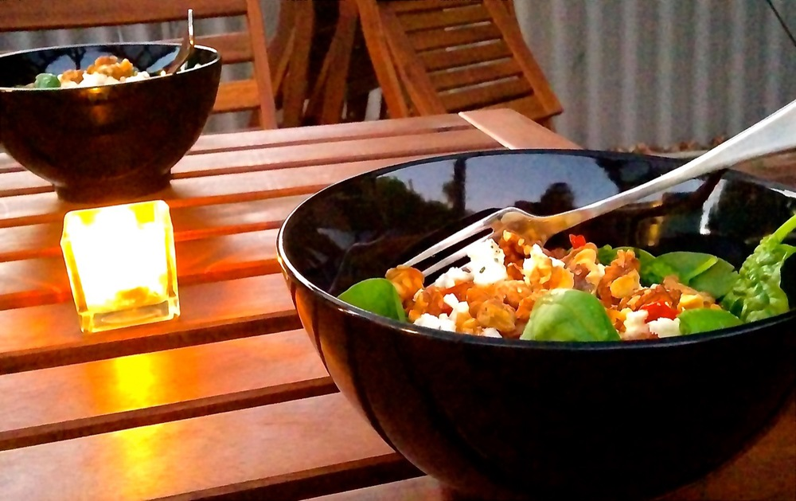

Like many cooking enthusiasts I spent the days leading up to Christmas planning lunch for Christmas day, with little thought given to Christmas eve. “I’ll throw something quick together” I thought. Christmas eve night arrives and I find my self staying with my sister, who mentions a mate’s helping her out with something and could we feed him too please? Okay, so now I’m in someone else’s kitchen, with someone else’s pantry and we’ve got guests for dinner. Oh dear. A quick (read ‘frantic’) rummage through lil’ sis’ supplies and ideas are starting to form. This is what I came up with and it was good enough to warrant photos and a recipe request from lil’ sis.

<!--more-->

The circumstances surrounding this meal did not lend themselves to highly specific ingredient requirements; i.e. go ahead and vary it up depending on what’s on hand and your own tastes.

If using store-bought pesto be sure to check the ingredients list for allergens or intolerances, and for vegan/nut-free versions skip the fetta/walnuts respectively too.

Serves 5

  * 1½ cups brown rice
  * 1 small sweet potato
  * olive oil
  * 2 cloves garlic
  * 250g swiss brown mushrooms
  * 1 bunch asparagus
  * 250g cherry tomatoes
  * 1 tin borlotti beans, rinsed and drained (or ½ cup dried borlotti beans, soaked overnight, cooked and drained)
  * ½ cup fresh basil, roughly chopped
  * salt and pepper
  * 200g sundried tomato pesto
  * 5 cups baby spinach
  * 125g fetta
  * ⅔ cup walnuts, lightly toasted and coarsely chopped

Preheat oven to 180ºC (350 F). Line a baking tray with baking paper.

Place the rice in a medium saucepan along with 2½ cups water. Bring to the boil over a high heat then reduce heat and simmer until rice is tender and water absorbed, about 30 minutes. (If saucepan dries out before the rice is cooked add a little more water.)

Meanwhile, peel the sweet potato and cut into cubes (approximately 1½ cm or ½ inch in size). Toss with 1 tablespoon olive oil then spread evenly on the baking tray. Bake in preheated oven until slightly golden and soft in the middle, about 30 minutes, turning after 15 minutes.

Now for the mushrooms and asparagus. Slice the mushrooms about ½ cm (¼ inch) thick; finely dice or crush the garlic; cut any tough ends off the asparagus and cut into bite-sized pieces. Heat 1 tablespoon olive oil in a frying pan over medium heat and add the garlic. Cook for 1-2 minutes until garlic is fragrant then add the mushrooms. Cook, stirring occasionally until mushrooms just start to brown lightly. Add the asparagus and cook for a few more minutes until asparagus is heated through and mushrooms are golden.

Set the mushrooms aside heat another tablespoon of olive oil in a frying pan. Add the cherry tomatoes and cook over a medium-high heat, stirring frequently, for 10 minutes to cook the tomatoes. Use a spatula to lightly crush the tomatoes in the pan, just enough to split the skins and release some juice. Add the borlotti beans, basil and a pinch each of salt and pepper. Cook for another 5 minutes to heat through and thicken up some of the tomato juices.

That’s most of the preparation done. To put it all together transfer the rice to a large bowl and stir through the pesto. Add the sweet potato, the mushroom and asparagus mix and the tomatoes and borlotti beans and mix it all together.

To serve, divide baby spinach between bowls and spoon rice mixture over the top. Top with toasted walnuts and crumbled fetta. Happy dinner!
