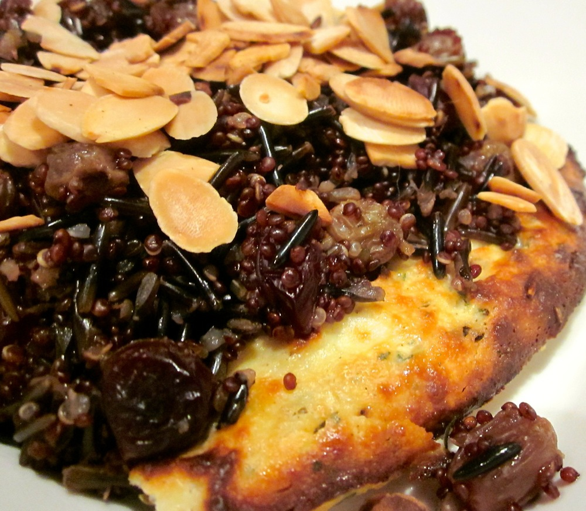

> _“It was a dark and stormy night during a miserably cold winter. Fortunately, thanks to Fresh & delish, they had the cosiest comfort food ever to warm them.”_

Okay, so please keep reading to discover that my culinary skills really are better than my somewhat lacking literary talents. This is absolutely one of my favourite meals for a cold stormy night; pair it with some warm mulled wine and you’re all set to beat the winter chills.

<!--more-->

The [wild rice & quinoa pilaf](#wildricequinoapilaf) is based on a recipe out of [1000 Gluten-Free Recipes][thousand-gluten-free-recipes], but I’ve been making the [baked ricotta](#bakedricotta) long enough that I can’t recall where the idea came from to properly acknowledge it. The ricotta and pilaf can also be made separately as accompaniments to other dishes, but the combination is my epitome of comfort food.

For this meal I usually get the rice cooking, then prepare the ricotta, and move the pilaf and ricotta to the oven at about the same time. Fresh ricotta has a very short shelf life so don’t buy it more than a day in advance or it may go sour.

For a nut free version, simply skip the almonds.

###  Wild rice and quinoa pilaf

Serves 4-5 as a side

  * 3/4 cup wild rice
  * 3/4 cup quinoa (black or red is most visually appealing, but all varieties work equally well in terms of flavour)
  * 3 cups vegetable stock (powdered is okay, just start with less powder than suggested as it is often very salty)
  * 1/4 cup dried cranberries
  * 1/4 cup sultanas
  * 1 tablespoon olive oil
  * 1/2 cup flaked or slivered almonds, toasted

Preheat oven to 180˚C. Combine wild rice and stock in a saucepan and simmer, covered, over a medium heat for 20 minutes.

If serving with baked ricotta, prepare that now then place in the oven at the same time as the pilaf.

Brush a cast iron or ceramic baking dish with olive oil.

Add the quinoa and dried fruit to the wild rice and stock, and stir to combine. Transfer mixture to the baking dish. Cover with a lid if available, otherwise with alfoil pricked in a few places to let excess steam out.

Bake until rice and quinoa are tender and liquid is absorbed, 45-60 minutes. If the dish dries out before the rice and quinoa are fully cooked just add a little more stock or water.

Serve spooned over the baked ricotta, and scatter almonds over the top.

###  Baked ricotta

Serves 4 as a side

  * 500g ricotta
  * 2 tablespoons olive oil
  * 2-4 teaspoons dried herbs or 2-4 tablespoons fresh finely chopped herbs\*
  * Pinch of pepper

\*Feel free to try different combinations of herbs and spices depending on what you’re serving the ricotta with. Personally I’m a fan of Scarborough Fair’s parsley, sage, rosemary and thyme, which pairs well with the pilaf. For some other ideas, how about oregano and basil ricotta topped with [tomato sauce][tomato-sauce]? Or mixing some toasted cumin and coriander seeds and a little ground cinnamon into the ricotta and serving with a [chickpea tagine][chickpea-tagine]? Perhaps replace the cinnamon with ground cloves or cardamon and pair with an indian curry? The possibilities are endless, and baked ricotta is versatile enough that it really is very hard to ruin.

Preheat oven to 180˚C (350 F) and brush a small (around 1-1.2 L) baking dish with olive oil.

Wrap ricotta in paper towel or cheesecloth and squeeze out any excess liquid. Transfer to a mixing bowl and add pepper and dried or chopped herbs. Mix well to combine. Taste and adjust seasoning if needed; I like to add a little black pepper but find the cheese generally doesn’t need any added salt.

Spoon ricotta into prepared baking dish and use the back of a dessert spoon to press down and flatten out until it is evenly spread over the dish. Transfer to the oven and bake until the top is a light golden-brown colour, about 45-60 minutes. Cut into slices and serve.

 [thousand-gluten-free-recipes]: http://www.amazon.com/1000-Gluten-Free-Recipes/dp/B00464EAVG%3FSubscriptionId%3D0ENGV10E9K9QDNSJ5C82%26tag%3Dfredel09-20%26linkCode%3Dxm2%26camp%3D2025%26creative%3D165953%26creativeASIN%3DB00464EAVG
 [tomato-sauce]: /2013/05/08/2013-4-30-spanakopita-filled-chickpea-crepes/#tomatosauce
 [chickpea-tagine]: /2013/04/01/2013-3-30-chickpea-tagine-with-morrocan-quinoa-pilaf/#chickpeatagine
